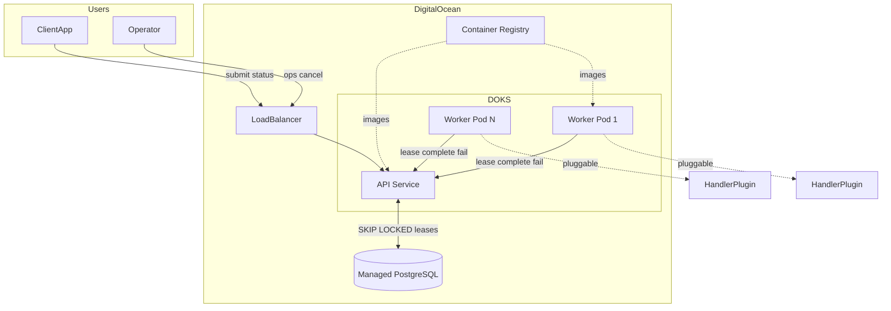
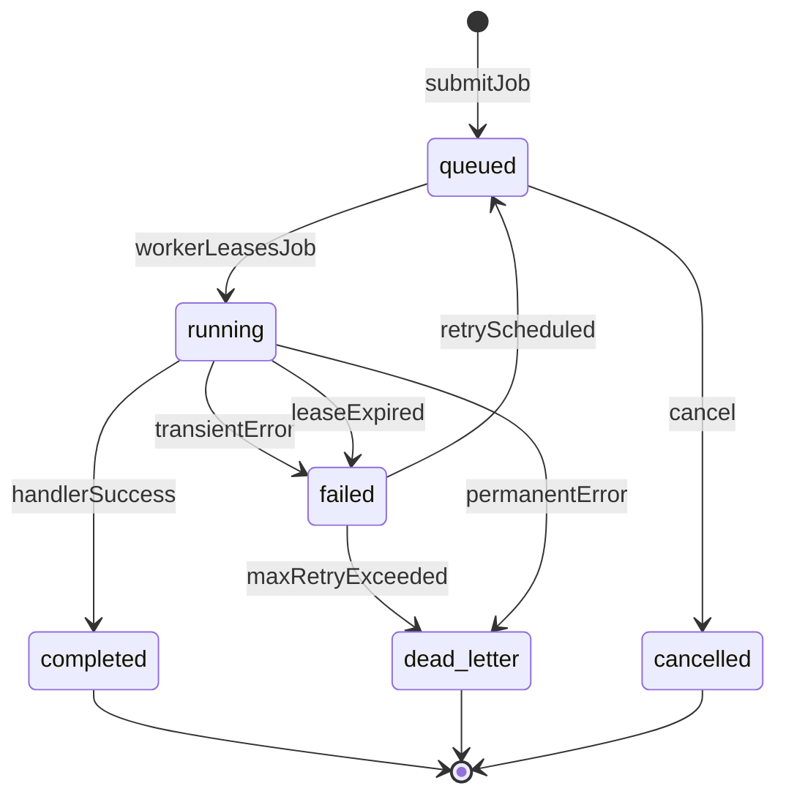
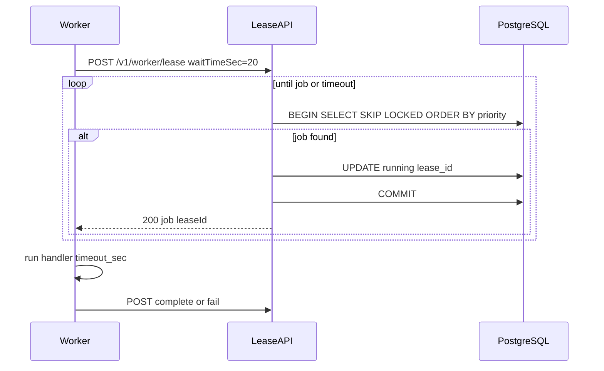

# Architecture

## System overview

## Job lifecycle

## Worker polling (workers do not touch DB)

**Idle load control:** long-poll ≈ 1 dequeue query/sec per waiting worker (not busy-spin).

## Pluggable handlers

1. Implement `JobHandler` in `handlers/*.handler.ts`
2. Register in `src/worker/registry.ts`
3. Client submits `"handler": "echo"` — worker dispatches via registry

Handlers return `success`, `transient_failure`, or `permanent_failure`. Platform handles retry/DLQ.

## Scaling (two independent paths)

| Path | Scales with | Bottleneck |
|------|-------------|------------|
| **Accept** (POST /v1/jobs) | api-hpa | PG INSERT rate |
| **Execute** (lease + handler) | worker-hpa | Worker count × handler duration |

**PG dequeue poll ceiling (~30–50 workers on 1 vCPU PG):** escape via Redis ZSET in Layer 3 without changing worker code.

## Resource isolation

| Layer | Mechanism |
|-------|-----------|
| Job timeout | `timeout_sec` + AbortSignal |
| Pod limits | K8s `resources.limits` (1 CPU / 512Mi MVP) |
| Concurrency | `WORKER_CONCURRENCY=1` MVP |
| Pool split | `worker-fast` vs `worker-heavy` Deployments (Layer 2) |

## Monitoring (MVP)

- **Users:** `GET /v1/jobs/{id}`
- **Operators:** `GET /v1/ops/queues/{q}/status`, structured logs
- **Layer 2:** Prometheus `/metrics` → HPA on queue depth

## Related documentation

| Topic | Doc |
|-------|-----|
| Every decision (first principles) | [EVERY-DECISION.md](EVERY-DECISION.md) |
| User & operator flows | [USER-FLOWS.md](USER-FLOWS.md) |
| Operations runbook | [RUNBOOK.md](RUNBOOK.md) |
| Low-level code + data layer | [CODE-AND-DATA.md](CODE-AND-DATA.md) |
| ADR (D1–D20) | [DECISIONS.md](DECISIONS.md) |

See [CODE-AND-DATA.md](CODE-AND-DATA.md) for a code review (Open/Closed, MVP gaps) and a detailed explanation of the PostgreSQL dequeue/lease/retry pattern.

**Lifecycle diagram vs code:** The state diagram above includes a `failed` status. The MVP implementation requeues transient failures directly to `queued` (with `next_retry_at`) rather than passing through a persistent `failed` row state. Terminal outcomes are `completed`, `dead_letter`, and `cancelled`.
