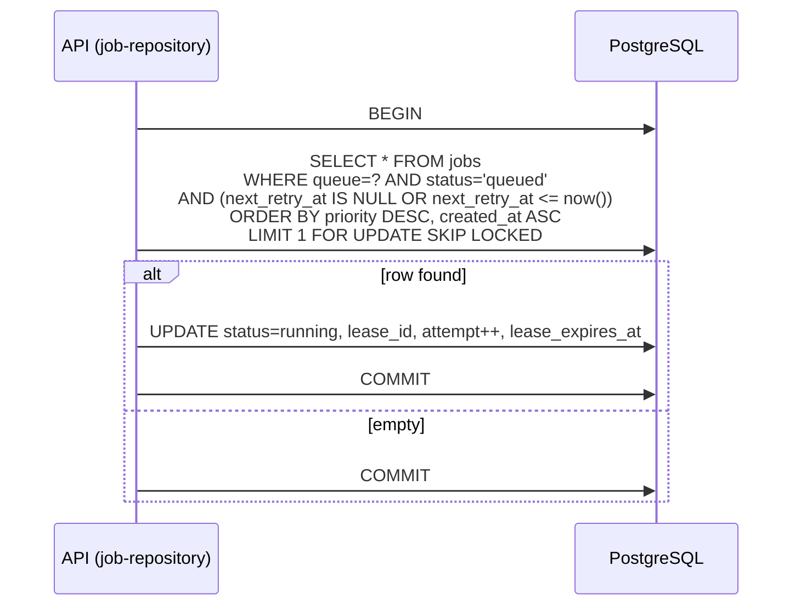

# Code review & data layer

This document records how the MVP application code is structured, whether it follows extensibility practices (Open/Closed, ports), and the PostgreSQL queue pattern we chose.

Related: [ARCHITECTURE.md](ARCHITECTURE.md), [DECISIONS.md](DECISIONS.md) (D6–D9, D11, D18).

---

## Layer map (what we built)

```
handlers/*.ts          →  JobHandler implementations (plugins)
src/domain/types.ts    →  Shared types + JobHandler interface
src/worker/registry.ts →  Handler registry (Open/Closed for new handlers)
src/worker/worker.ts   →  Poll loop; HTTP to API only (no DB)
src/api/server.ts      →  HTTP routes; calls repository directly
src/infrastructure/    →  db.ts (pool), job-repository.ts (SQL)
migrations/001_jobs.sql →  Schema + indexes
```

| Layer | Planned | Implemented |
|-------|---------|-------------|
| **Handlers (plugins)** | `JobHandler` + registry | Yes — add handler + register, no worker loop change |
| **Domain types** | Shared job/handler types | Yes |
| **Application / use cases** | SubmitJob, LeaseJob, etc. | **Skipped** — API calls repository functions |
| **Ports (interfaces)** | `QueuePort`, `JobRepository` | **Skipped** — concrete `job-repository.ts` only |
| **Infrastructure** | PostgreSQL implementation | Yes |
| **Presentation** | Fastify routes | Yes |

**Verdict:** This is a **pragmatic MVP**, not strict hexagonal architecture. The important extensibility point — **pluggable handlers** — is done well. Swapping PostgreSQL for Redis later would require extracting a port interface (D18).

---

## Open/Closed and related practices

### What we did well

**1. Handler plugins (Open/Closed)**

New job types are added by implementing `JobHandler` and calling `registerHandler()` — the worker loop and API lease flow stay unchanged.

```typescript
// src/domain/types.ts — stable extension point
export interface JobHandler {
  readonly handlerType: string;
  handle(ctx: JobContext, payload: unknown): Promise<HandlerResult>;
}
```

**2. Workers isolated from the database (D7)**

Workers only call the Worker Lease API (`/v1/worker/lease`, complete, fail). Connection pooling and `SKIP LOCKED` logic live in one place (API + repository). This matches the architecture diagram and scales worker pods independently.

**3. Separate deployables (D12)**

`api` and `worker` are different processes/images. Accept path and execute path scale via separate HPAs.

**4. Lease-based deduplication (D9)**

`completeJob` / `failJob` require `lease_id` + `status = 'running'`. A stale or duplicate complete/fail returns `409 lease_expired` — correct for at-least-once delivery.

**5. Transactional dequeue**

`tryLeaseOnce` uses `BEGIN` → `SELECT … FOR UPDATE SKIP LOCKED` → `UPDATE status = 'running'` → `COMMIT` on a single connection. Two workers cannot lease the same row.

**6. Indexes aligned with queries**

Partial indexes match hot paths: dequeue (`status = 'queued'`) and sweeper (`status = 'running'` + `lease_expires_at`).

### MVP shortcuts (honest gaps)

These are acceptable for a 1-hour MVP but worth fixing in Layer 2:

| Issue | Location | Risk | Suggested fix |
|-------|----------|------|----------------|
| No `JobRepository` port | `job-repository.ts` | Hard to test or swap PG | Introduce interface; API depends on port |
| API imports worker registry | `server.ts` → `listHandlers()` | Presentation coupled to worker package | Move allowed-handlers list to env/config only, or shared domain module |
| Idempotent submit is a no-op | `createJob` `ON CONFLICT DO UPDATE SET job_id = EXCLUDED.job_id` | Re-submit with same `jobId` still returns row but doesn’t guarantee “same job unchanged” semantics | `ON CONFLICT DO NOTHING` + `SELECT`, or return existing explicitly |
| `failed` status unused in runtime | `failJob` requeues to `queued` | Diagram in ARCHITECTURE shows `failed` state; code skips it | Either use `failed` + sweeper to `queued`, or update diagram to match |
| `cancelJob` allows `failed` but not `running` | `cancelJob` SQL | Running jobs can’t be cancelled via ops API | Add lease revoke path or document limitation |
| `mapRow` unsafe cast | `job-repository.ts` | Bad DB data → runtime surprises | Map columns explicitly or use zod |
| Sweeper calls `failJob` in a loop | `sweepExpiredLeases` | N connections per sweep batch | Batch update in one transaction |
| Long-poll holds no connection | `leaseNextJob` sleep between tries | Good — only short transactions | Keep as-is |
| No unit tests yet | — | Regressions on retry/DLQ logic | Test `backoffSeconds`, lease race, DLQ threshold |

None of these block the MVP verify gates; they are documented so we don’t mistake “works” for “finished architecture.”

---

## PostgreSQL queue pattern

### Decision summary

| Decision | Choice | Why |
|----------|--------|-----|
| **Queue storage** | Rows in `jobs` table | One source of truth; no extra broker for MVP (D6) |
| **Dequeue concurrency** | `FOR UPDATE SKIP LOCKED` | Standard PG pattern; workers don’t block each other |
| **Ordering** | `ORDER BY priority DESC, created_at ASC` | Durable priority without in-memory heap (D8) |
| **Worker access** | HTTP lease API only | Pooling + security boundary (D7) |
| **Retry** | Requeue to `queued` + `next_retry_at` | Exponential backoff in app layer |
| **DLQ** | `status = 'dead_letter'` | Same table; no separate DLQ table in MVP (D10) |
| **Lease timeout** | `lease_expires_at` + sweeper | Recovers stuck `running` jobs |
| **Idempotency key** | Unique `job_id` | Client-supplied or server UUID |

### Schema (single table)

```sql
-- migrations/001_jobs.sql (conceptual)
jobs (
  id,              -- internal PK
  job_id,          -- client-visible id (UNIQUE)
  queue, handler, payload,
  priority,        -- 4=critical … 1=low
  max_retry, timeout_sec,
  status,          -- queued | running | completed | dead_letter | cancelled
  attempt,         -- incremented on each lease
  lease_id, worker_id, lease_expires_at,
  next_retry_at,   -- backoff gate for requeued jobs
  last_error, timestamps…
)
```

**Why one table:** Queue depth, running leases, completed history, and DLQ are different *views* of the same job lifecycle. Splitting into `queue` + `job_state` tables adds joins without MVP benefit.

### Dequeue flow



- **`SKIP LOCKED`:** If worker A locks row 1, worker B skips it and takes row 2 — no waiting on locks.
- **`next_retry_at`:** Retried jobs stay `queued` but are invisible until backoff elapses.
- **Partial index `idx_jobs_dequeue`:** Index only `status = 'queued'` rows — smaller, faster scans.

### Complete / fail flow

| Event | SQL effect |
|-------|------------|
| **Success** | `status = completed`, clear lease columns, set `completed_at` |
| **Transient fail** (attempt < max_retry) | `status = queued`, clear lease, set `next_retry_at = now() + backoff(attempt)` |
| **Permanent fail** or attempt ≥ max_retry | `status = dead_letter`, store `last_error` |
| **Lease expired** (sweeper) | Same as transient fail via `failJob(..., 'transient', LEASE_EXPIRED)` |

Backoff schedule (seconds): `10 → 30 → 90 → 300` (`backoffSeconds()` in `job-repository.ts`).

### At-least-once semantics

1. Worker receives job + `leaseId`.
2. Handler runs (may succeed after partial side effects).
3. Worker reports complete/fail with `leaseId`.
4. If worker crashes before report, lease expires → sweeper requeues → **another worker may run again**.

Handlers must be **idempotent** or use external dedup (D9). The platform prevents *duplicate completion* via lease checks, not duplicate *execution*.

### Scaling limits (why Redis is Layer 3)

Each idle worker long-polling causes ~1 dequeue transaction/sec on an empty queue. On a small Managed PG instance, ~30–50 concurrent pollers is a practical ceiling before CPU/contention rises (D19). Escape path: Redis ZSET buffer in front of PG without changing worker HTTP contract.

---

## How code maps to decisions

| Decision | Code location |
|----------|---------------|
| D6 PG queue | `migrations/001_jobs.sql`, `tryLeaseOnce` |
| D7 Worker ↔ API | `src/worker/worker.ts` (fetch only) |
| D8 Priority index | `idx_jobs_dequeue`, `ORDER BY priority DESC` |
| D9 Lease dedup | `finishLease`, `failJob` WHERE `lease_id` + `running` |
| D10 Retry/DLQ | `failJob`, `backoffSeconds` |
| D11 Handler registry | `src/worker/registry.ts`, `handlers/*.ts` |
| D18 Ports (deferred) | Not yet — refactor target |

---

## Recommended Layer 2 refactors (priority order)

1. **`JobRepository` interface** — API depends on port; PG module implements it (enables tests + Redis swap).
2. **Fix idempotent `createJob`** — correct `ON CONFLICT` behavior for client `jobId`.
3. **Align lifecycle docs with code** — either implement `failed` status or simplify ARCHITECTURE state diagram.
4. **Decouple API from `worker/registry`** — config-driven `ALLOWED_HANDLERS` is enough for MVP ops.
5. **Batch sweeper** — one transaction for expired leases.

---

## Review conclusion

**The low-level queue code follows established PostgreSQL job-queue practice** (transactional SKIP LOCKED, partial indexes, lease columns, backoff + DLQ in one table). It is not “just make it work” SQL — it matches patterns used by pg-boss-style systems at MVP scale.

**Extensibility:** Handler plugins are properly Open/Closed. The rest of the stack is thin and direct; ports and use-case layers were intentionally deferred (D17/D18) to ship in one hour. The structure is **refactor-friendly** because domain types and handler boundaries already exist — the next step is extracting `JobRepository` without changing HTTP or worker contracts.
