# DigitalOcean Job Queue System — Functional Requirements Plan

## Context

Greenfield project in [`/workspaces/my-project`](/workspaces/my-project). Build a **job queue platform** on DigitalOcean (not AWS SQS-compatible) with:

- **Control-plane API** for end users to submit jobs and query status
- **Independently scalable worker fleet** that pulls jobs and runs **pluggable handlers**
- **Retry + DLQ** for transient failures
- **At-least-once delivery** with **duplicate-execution prevention**
- **Ops API** for queue depth, cancellation, and worker utilization
- **GitHub CI/CD** functional pipeline
- **Extensible architecture** for delayed execution and recurring jobs (v2)
- **Observability** (metrics, tracing, dashboards) deferred to v2

---

## Architecture decisions and trade-offs (master record)

All decisions taken in this planning session, with rationale and accepted trade-offs.

### Decision summary table

| # | Decision | Choice | Alternatives considered | Trade-off accepted |
|---|----------|--------|-------------------------|-------------------|
| D1 | **Platform** | Custom job queue on DigitalOcean | AWS SQS, RabbitMQ managed, Celery-only | No AWS SDK compatibility; we own ops |
| D2 | **Cloud infra** | DOKS + Managed PostgreSQL + DOCR | App Platform, raw Droplets, serverless | DOKS setup time (~10 min); full K8s control |
| D3 | **IaC / provisioning** | `doctl` shell scripts (MVP) | Terraform, Pulumi | Less reproducible initially; faster for 1 hour |
| D4 | **API style** | Custom REST (not SQS-compatible) | SQS-compatible API | Existing AWS SDK clients won't work |
| D5 | **Runtime** | TypeScript + Fastify (recommended) | Python FastAPI, Go | Team must know TS; fast MVP scaffolding |
| D6 | **Queue store (MVP)** | PostgreSQL `SKIP LOCKED` | Redis, NATS, Kafka | PG becomes dequeue bottleneck at ~50+ workers; escape via Redis Layer 3 |
| D7 | **Workers poll DB?** | **No** — workers HTTP-poll Worker Lease API | Workers connect to PG directly | Extra API hop; better security and pooling |
| D8 | **Priority scheduling** | PG index + `ORDER BY priority DESC` | In-memory heap, 4 physical queues | Not a heap; B-tree index gives same semantics |
| D9 | **Delivery guarantee** | At-least-once + lease dedup | Exactly-once (Kafka transactions) | Handlers must be idempotent for side effects |
| D10 | **Retry / DLQ** | Transient vs permanent failure; `max_retry` | Infinite retry | Poison jobs need DLQ monitoring |
| D11 | **Handler model** | Pluggable `JobHandler` registry in worker | Inline switch/case, separate microservices per handler | Rebuild worker image to add handlers (MVP) |
| D12 | **API vs worker deploy** | Separate K8s Deployments | Single binary, sidecar | Two images to build; clean scaling |
| D13 | **Autoscaling** | Dual HPA: `api-hpa` + `worker-hpa` | Manual scale, single HPA | CPU-based MVP; queue-depth metric Layer 2 |
| D14 | **Auth (MVP)** | None / dev mode | JWT, API keys | Not production-safe until Layer 4 |
| D15 | **Observability (MVP)** | Ops JSON API + structured logs | Prometheus from day 1 | Less visibility initially; faster ship |
| D16 | **CI/CD** | GitHub Actions: lint + integration + DO deploy | GitLab CI, no CI | Requires `DIGITALOCEAN_ACCESS_TOKEN` secret |
| D17 | **Time scope** | 1-hour MVP + layered stretch | Full system in one pass | Many FRs deferred to Layer 2–4 |
| D18 | **Extensibility** | Domain ports (`QueuePort`, `JobScheduler` stubs) | Big-design-up-front monorepo | Some refactor when splitting packages |
| D19 | **Dequeue poll protection** | Long-poll + indexes + pool cap (MVP); Redis dequeue (Layer 3) | Poll PG every lease attempt forever | ~30–50 worker ceiling on 1 vCPU PG until Redis |
| D20 | **1-hour target environment** | **DigitalOcean only** — no local-MVP fallback | Local docker-compose primary | Requires DO token + ~15 min infra wait; all verify gates on Ingress URL |

---

## Worker concurrency and resource isolation

This section answers: **Does one worker = one job? Can multiple jobs run on the same server? How do we stop one handler from hogging the machine?**

### Terminology

| Term | Meaning |
|------|---------|
| **K8s Node (server)** | A physical/virtual machine in the DOKS cluster |
| **Worker Pod** | One running instance of the worker container |
| **Concurrency slot** | One in-flight job inside a pod (`WORKER_CONCURRENCY`) |
| **Handler** | User code that processes a single job payload |

### Concurrency model — three levels

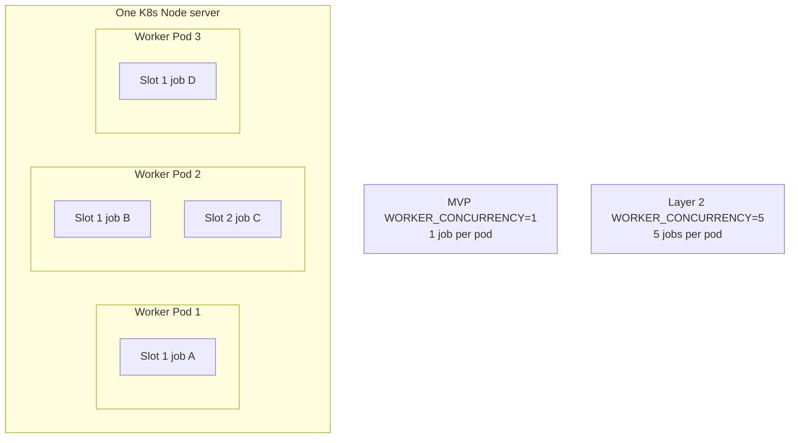
```mermaid
flowchart TB
  subgraph node [One K8s Node server]
    subgraph pod1 [Worker Pod 1]
      S1[Slot 1 job A]
    end
    subgraph pod2 [Worker Pod 2]
      S2[Slot 1 job B]
      S3[Slot 2 job C]
    end
    subgraph pod3 [Worker Pod 3]
      S4[Slot 1 job D]
    end
  end

  Note1[MVP WORKER_CONCURRENCY=1<br/>1 job per pod]
  Note2[Layer 2 WORKER_CONCURRENCY=5<br/>5 jobs per pod]
```

| Level | MVP default | Layer 2+ | Explanation |
|-------|-------------|----------|-------------|
| **Jobs per worker pod** | **1** (`WORKER_CONCURRENCY=1`) | Configurable N | One pod can run **multiple jobs in parallel** by raising env var |
| **Worker pods per node** | Several (K8s scheduler decides) | HPA adds more | **Multiple pods** share the same server |
| **Jobs per node** | pods-on-node × concurrency | Scales with HPA | **Yes — many jobs on one server** via multiple pods × slots |

**Important:** We do **not** assign one job per physical server. We assign **one job per concurrency slot per pod**. A server typically runs **many pods**, each handling one or more jobs.

### Worker pod internal loop (with concurrency)

```typescript
// MVP: CONCURRENCY = 1 → sequential
// Layer 2: CONCURRENCY = 5 → up to 5 parallel lease/process cycles
const concurrency = parseInt(process.env.WORKER_CONCURRENCY ?? '1', 10);
const semaphore = new Semaphore(concurrency);

async function workerSlot() {
  while (true) {
    await semaphore.acquire();
    try {
      const job = await leaseJob();           // blocks until job or empty
      if (!job) { semaphore.release(); continue; }
      await processJob(job);                  // handler + complete/fail
    } finally {
      semaphore.release();
    }
  }
}

// Start `concurrency` independent slot loops per pod
Array.from({ length: concurrency }, () => workerSlot());
```

Each slot: **lease one job → run handler → complete/fail → lease again**. Slots in the same pod run **in parallel** when `WORKER_CONCURRENCY > 1`.

### Preventing one handler from taking entire server resources

Defense in **four layers**:

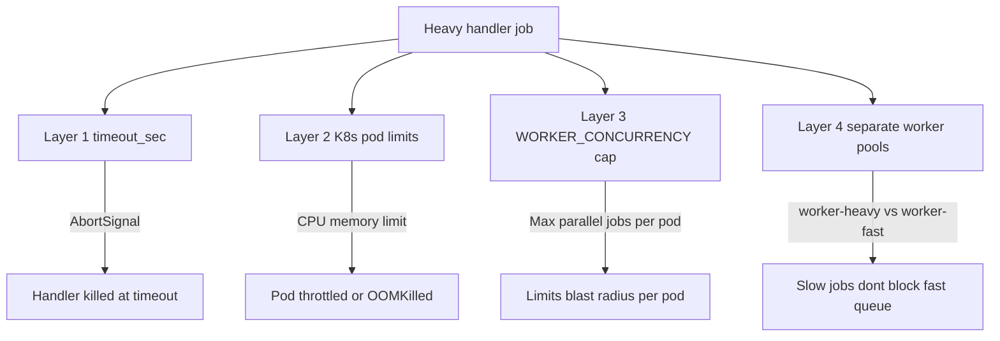
```mermaid
flowchart TB
  Job[Heavy handler job] --> L1[Layer 1 timeout_sec]
  Job --> L2[Layer 2 K8s pod limits]
  Job --> L3[Layer 3 WORKER_CONCURRENCY cap]
  Job --> L4[Layer 4 separate worker pools]

  L1 -->|AbortSignal| Stop[Handler killed at timeout]
  L2 -->|CPU memory limit| Throttle[Pod throttled or OOMKilled]
  L3 -->|Max parallel jobs per pod| Bound[Limits blast radius per pod]
  L4 -->|worker-heavy vs worker-fast| Isolate[Slow jobs dont block fast queue]
```

| Layer | Mechanism | Config | Effect |
|-------|-----------|--------|--------|
| **1 — Job timeout** | `timeout_sec` + `AbortSignal` | Per job on submit | Handler cancelled; job retried or DLQ |
| **2 — Pod resource limits** | K8s `resources.limits` | `deploy/worker.yaml` | Pod cannot exceed e.g. 1 CPU / 512Mi; OOM kills **pod**, not node |
| **3 — Concurrency cap** | `WORKER_CONCURRENCY` | Env per Deployment | One bad job affects at most N slots in **one pod** |
| **4 — Pool isolation** | Separate worker Deployments | `worker-fast`, `worker-heavy` | CPU hogs isolated to heavy pool; critical queue unaffected |
| **5 — Lease sweeper** | `lease_expires_at` | Platform | Runaway handler loses lease; job requeued |

**Example `deploy/worker.yaml` (MVP):**

```yaml
spec:
  containers:
    - name: worker
      env:
        - name: WORKER_CONCURRENCY
          value: "1"              # MVP: one job at a time per pod
        - name: WORKER_QUEUES
          value: "default"
      resources:
        requests:
          cpu: "250m"
          memory: "256Mi"
        limits:
          cpu: "1000m"            # max 1 full CPU core per pod
          memory: "512Mi"         # OOMKill pod if exceeded
```

**What happens if a handler tries to use entire server:**

| Scenario | System response |
|----------|-----------------|
| Infinite loop | Killed at `timeout_sec`; lease expires; retry/DLQ |
| Memory leak | Pod hits `512Mi` limit → OOMKilled → K8s restarts pod → lease sweeper requeues job |
| CPU burn | Capped at `1000m` (1 core) per pod; other pods on same node unaffected |
| Blocks event loop (Node.js) | Same pod slots stall; other **pods** continue; reduce concurrency or isolate pool |

**Trade-off:** K8s limits cap **per pod**, not per job thread. With `WORKER_CONCURRENCY=5`, five jobs **share** the pod's 1 CPU / 512Mi. For heavy jobs, use **concurrency=1** and **separate heavy-worker Deployment** with higher limits.

### Recommended deployment patterns

| Workload | Deployment | CONCURRENCY | Limits |
|----------|------------|-------------|--------|
| Fast jobs (< 5s) | `worker-fast` | 5–10 | 1 CPU / 512Mi |
| Heavy jobs (> 60s) | `worker-heavy` | 1 | 2 CPU / 2Gi |
| Critical queue | `worker-critical` | 1–2 | Dedicated nodes (Layer 4 taints) |

---

## Decision trade-offs deep dive

### PostgreSQL as queue (D6)

| Pros | Cons |
|------|------|
| Single source of truth | Dequeue contention at high worker count |
| ACID leases | Write amplification per transition |
| No extra service in MVP | Needs Redis escape path at scale |
| `SKIP LOCKED` is well-understood | Long-poll holds API connections |

**When to revisit:** p95 lease latency > 500ms or > 50 concurrent workers.

### Workers via API, not direct DB (D7)

| Pros | Cons |
|------|------|
| No DB creds in worker pods | API is dequeue bottleneck |
| Centralized pooling and indexes | Extra network hop |
| Swap dequeue impl without worker change | Worker Lease API must scale with workers |

### At-least-once, not exactly-once (D9)

| Pros | Cons |
|------|------|
| Simpler than distributed transactions | Duplicate side effects possible |
| Industry-standard for job queues | Handlers must use idempotency keys |
| Lease + executionId helps | Crash during external API call may double-call |

### Pluggable handlers via registry (D11)

| Pros | Cons |
|------|------|
| Clean separation of platform vs business logic | MVP requires image rebuild per handler |
| Easy to test handlers in isolation | All handlers share pod resources unless pooled |
| Same interface for all job types | No versioned rollout until Layer 4 |

### Dual HPA (D13)

| Pros | Cons |
|------|------|
| Submit burst won't starve workers and vice versa | Two metrics to tune |
| Matches async control-plane model | CPU-only MVP HPA lags queue-depth signal |
| Standard K8s pattern | HPA cooldown ~3 min scale-down delay |

---

## Layer roadmap (what ships when)

| Layer | Time | Ships | Defers |
|-------|------|-------|--------|
| **MVP (hour 1) — ALL ON DO** | ~60 min | Full discussed scope on DOKS + Managed PG: submit, status, lease, worker, handlers, retry, DLQ, sweeper, priority index, ops depth/cancel, dual HPA, long-poll, CI, e2e-do smoke | Redis, Prometheus, heartbeat, auth, delayed/recurring |
| **Layer 2** | Post-MVP | Heartbeat, visibility API, Prometheus, HPA on queue depth | Redis |
| **Layer 3** | Post-MVP | Redis hot queue, worker utilization ops | Terraform |
| **Layer 4** | Later | Auth, Grafana, KEDA, recurring jobs | — |

---

## Prerequisites and access checklist (run before execute)

**Current environment status** (checked at plan time):

| Tool | Required | Status | Action before execute |
|------|----------|--------|----------------------|
| `doctl` | Yes | Installed | Run `doctl auth init` or `doctl auth init -t $DIGITALOCEAN_ACCESS_TOKEN` |
| `DIGITALOCEAN_ACCESS_TOKEN` | Yes | **Not set** | User sets token (manual setup per user choice) |
| `docker` | Yes | **Not installed** | Install Docker for image build + push to DOCR |
| `kubectl` | Yes | **Not installed** | Install kubectl for DOKS deploy |
| `git` | Yes | Installed | Repo empty at `/workspaces/my-project` — init + commit during execute |
| `gh` | Optional | Installed, **not logged in** | `gh auth login` if pushing CI to GitHub remote |
| `node` / `npm` | Yes | v24 installed | Use TypeScript + Fastify stack |

**Script:** `scripts/check-prereqs.sh` — exits non-zero if any required tool/auth missing. **Phase 0 step 0** before spending money on DO resources.

---

## DigitalOcean services — what we use and why (speed-first)

Use **only** these DO services for the 1-hour MVP — no self-hosted Postgres on Droplets, no App Platform (needs separate worker scaling model).

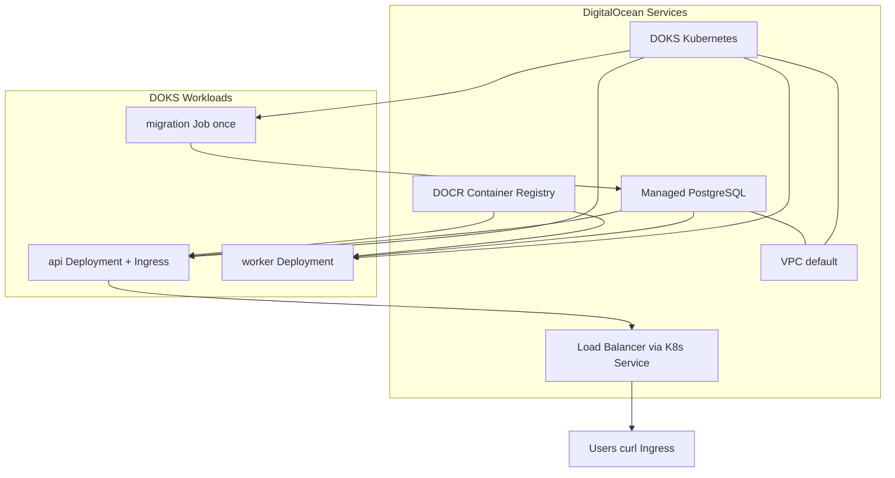
```mermaid
flowchart TB
  subgraph do_services [DigitalOcean Services]
    DOCR[DOCR Container Registry]
    PG[Managed PostgreSQL]
    DOKS[DOKS Kubernetes]
    LB[Load Balancer via K8s Service]
    VPC[VPC default]
  end

  subgraph workloads [DOKS Workloads]
    API[api Deployment + Ingress]
    Worker[worker Deployment]
    Migrate[migration Job once]
  end

  DOCR --> API
  DOCR --> Worker
  PG --> API
  PG --> Worker
  DOKS --> API
  DOKS --> Worker
  DOKS --> Migrate
  Migrate --> PG
  API --> LB
  LB --> Users[Users curl Ingress]
  PG --- VPC
  DOKS --- VPC
```

| DO service | Purpose in MVP | Why it speeds us up |
|------------|------------------|---------------------|
| **Managed PostgreSQL** | Job store, queue (`SKIP LOCKED`), leases, DLQ | No PG install/backup/ops; connection string via `doctl databases connection` |
| **DOKS** | Run api + worker as separate Deployments | Native HPA, separate scaling, industry-standard deploy |
| **DOCR** | Store `api` and `worker` images | Integrated with DOKS; `doctl registry login` |
| **DO Load Balancer** | Public Ingress to API | Created automatically by K8s `Service type: LoadBalancer` or nginx ingress |
| **Default VPC** | PG + DOKS same network | Add K8s cluster as PG **trusted source** — secure, low-latency |
| **NOT in hour 1** | Redis, App Platform, Droplets, Spaces | Avoid extra provisioning; Redis is Layer 3 escape hatch |

**Estimated infra provision time:** 8–15 minutes (`--wait`). Code is written **while cluster creates**, but **no feature verify gates run until Phase 0 infra check passes**.

---

## Protecting PostgreSQL from worker poll load

Worker lease polling **is** the primary MVP bottleneck — you are correct. Workers do not hit PG directly, but each long-poll holds an API thread that runs dequeue queries. This section documents **every mitigation**, what ships in hour 1, and when to add Redis.

### Where DB load comes from

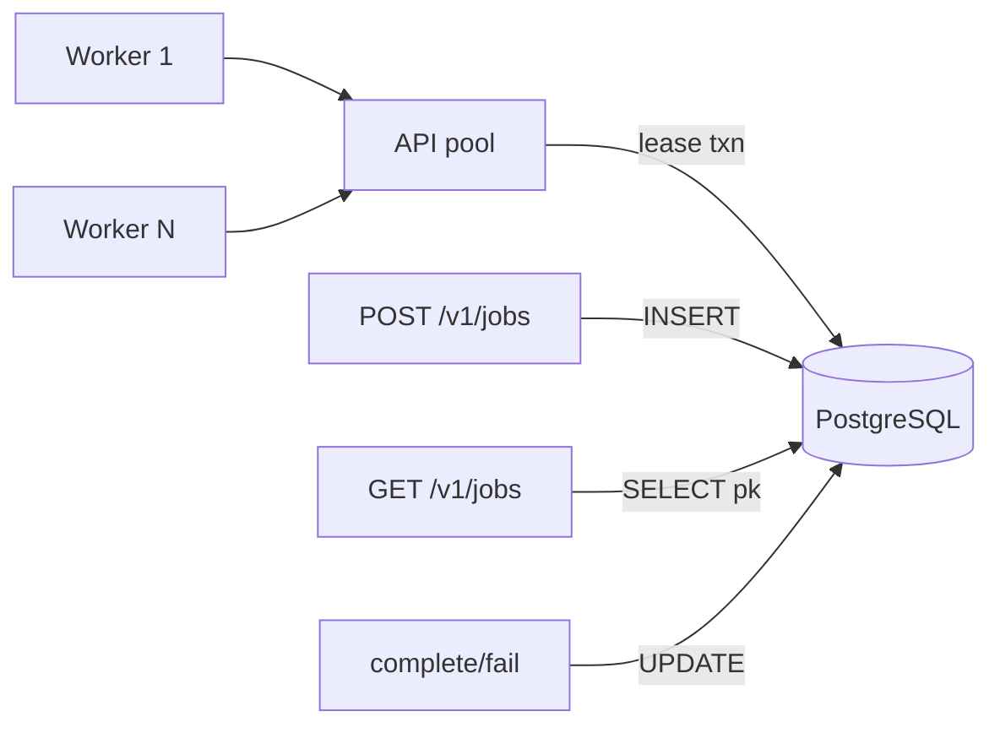
```mermaid
flowchart LR
  W1[Worker 1] --> API[API pool]
  W2[Worker N] --> API
  API -->|"lease txn"| PG[(PostgreSQL)]

  Submit[POST /v1/jobs] -->|"INSERT"| PG
  Status[GET /v1/jobs] -->|"SELECT pk"| PG
  Complete[complete/fail] -->|"UPDATE"| PG
```

| Query type | Source | Relative load |
|------------|--------|---------------|
| **Lease dequeue** (`SKIP LOCKED` txn) | N workers long-polling | **Highest under idle + high worker count** |
| **Submit INSERT** | User burst | High during accept spikes |
| **Complete/fail UPDATE** | Workers | One per job — proportional to throughput |
| **Status SELECT** | Users polling | Usually cheap (PK lookup) |
| **Lease sweeper** | API background | Low if indexed |

**Worst case:** 50 workers, empty queue, no long-poll → 50 × many queries/sec → PG pain.  
**Our design avoids this** with long-poll + indexed single-row dequeue.

### Mitigation stack (MVP → Layer 3)

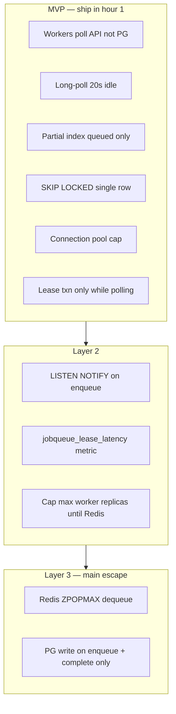
```mermaid
flowchart TB
  subgraph mvp [MVP — ship in hour 1]
    M1[Workers poll API not PG]
    M2[Long-poll 20s idle]
    M3[Partial index queued only]
    M4[SKIP LOCKED single row]
    M5[Connection pool cap]
    M6[Lease txn only while polling]
  end

  subgraph layer2 [Layer 2]
    L1[LISTEN NOTIFY on enqueue]
    L2[jobqueue_lease_latency metric]
    L3[Cap max worker replicas until Redis]
  end

  subgraph layer3 [Layer 3 — main escape]
    R1[Redis ZPOPMAX dequeue]
    R2[PG write on enqueue + complete only]
  end

  mvp --> layer2 --> layer3
```

#### MVP mitigations (built into hour-1 foundation)

| # | Technique | How it reduces PG load |
|---|-----------|------------------------|
| **1** | **API as gatekeeper** | Workers never open PG connections; fixed pool (e.g. 20 conn × 2 API pods = 40 max to PG) |
| **2** | **Long-poll (20s)** | Empty queue → ~**1 dequeue attempt/sec per waiting worker**, not hundreds/sec |
| **3** | **Partial index** `WHERE status='queued'` | Dequeue never scans completed/DLQ rows |
| **4** | **Composite index** `(queue, priority DESC, created_at)` | Index-only seek to next job; O(log N) not full scan |
| **5** | **`LIMIT 1 FOR UPDATE SKIP LOCKED`** | Minimal lock scope; concurrent workers skip locked rows |
| **6** | **Short transactions** | BEGIN → SELECT → UPDATE → COMMIT in one round-trip; no work while handler runs |
| **7** | **No poll during execution** | Worker holds **zero** DB connections while handler runs — only HTTP to complete/fail at end |
| **8** | **Pool sizing** | `max = 20` per API pod; excess lease requests queue in API (503/backpressure) rather than opening unlimited PG conns |
| **9** | **Sweeper index** `(status, lease_expires_at) WHERE status='running'` | Background reclaim doesn't table-scan |

**Load math (empty queue, 20 workers long-polling):**

```
~20 workers × 1 query/sec ≈ 20 dequeue QPS to PG  (manageable on 1 vCPU PG)
Without long-poll: 20 × 100/sec = 2000 QPS  (would crush PG)
```

**Load math (busy queue, 20 workers, jobs available):**

```
~1 txn per job leased ≈ throughput-bound, not poll-bound  (healthy)
```

#### Layer 2 — reduce idle poll further

| Technique | Effect |
|-----------|--------|
| **`LISTEN job_enqueued`** | API blocks on PG notify; **zero** poll queries while idle; wake on INSERT |
| **`jobqueue_lease_latency_seconds` metric** | Alert when p95 > 500ms — signal to add Redis |
| **Documented worker ceiling** | MVP ops runbook: max ~30–50 workers per 1 vCPU PG without Redis |
| **PgBouncer** | Multiplex many API threads onto fewer PG connections |

#### Layer 3 — remove dequeue from PG (primary scale fix)

| Before (MVP) | After (Layer 3) |
|--------------|-----------------|
| Every lease = PG `SKIP LOCKED` txn | Lease = **`ZPOPMAX`** from Redis ZSET |
| PG stores all state | PG still **source of truth**; Redis is hot buffer |
| Workers unchanged | Same `/v1/worker/lease` API |

Enqueue flow: `INSERT PG` + `ZADD Redis` (async OK).  
Dequeue flow: `ZPOPMAX Redis` → `UPDATE PG running` (one PG write per job, no poll loop).

### Backpressure when PG is stressed

| Signal | API behavior |
|--------|--------------|
| Pool exhausted | `503 Service Unavailable` on lease; workers retry with jitter |
| Query timeout | Abort lease attempt; worker long-poll continues |
| High `lease_latency` | Ops alert; scale API pods or add Redis |

Workers treat 503 like empty queue — **back off**, don't spin.

### Honest bottleneck summary

| Scale | PG lease poll OK? | Action |
|-------|-------------------|--------|
| 2–10 workers | Yes | MVP as designed |
| 10–30 workers, moderate queue | Yes with indexes + long-poll | Monitor `lease_latency` |
| 30–50 workers, often empty queue | Borderline | Add LISTEN/NOTIFY or Redis |
| 50+ workers or p95 lease > 500ms | **No** | **Layer 3 Redis** for dequeue |
| Submit burst 10k jobs | INSERT bound, not poll | Scale API HPA; PG vertical resize |

**You are right:** PG dequeue polling is the **execution-side** ceiling in MVP. Accept path (INSERT) is the **control-plane** ceiling. Both are addressed — accept scales with API HPA; execute poll ceiling escapes to Redis without redesigning workers.

### Decision recorded (D19)

| # | Decision | Choice | Trade-off |
|---|----------|--------|-----------|
| D19 | **Dequeue poll protection** | Long-poll + indexes + pool cap (MVP); Redis dequeue (Layer 3) | Accept PG limit ~30–50 workers until Redis; avoids operating Redis in hour 1 |

---

## What we are building (executive summary)

A **job queue platform on DigitalOcean** where clients submit work with `jobId`, `priority`, `max_retry`, and `timeout_sec`; **independently scalable workers** pull jobs and run **pluggable handlers**; failures retry automatically and eventually land in a **dead-letter queue**; clients poll a **status API** (`queued` → `running` → `completed` / `failed` / `dead_letter`); operators monitor **queue depth** and **cancel jobs**.

**Hour-1 MVP** delivers the core loop on **DOKS + Managed PostgreSQL**, provisioned by **`doctl`**.

### System overview (MVP)

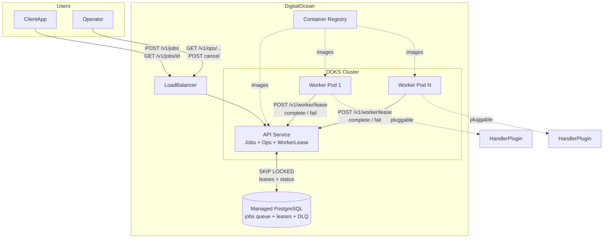
```mermaid
flowchart TB
  subgraph users [Users]
    Client[ClientApp]
    Operator[Operator]
  end

  subgraph do [DigitalOcean]
    LB[LoadBalancer]

    subgraph doks [DOKS Cluster]
      API[API Service<br/>Jobs + Ops + WorkerLease]
      W1[Worker Pod 1]
      W2[Worker Pod N]
    end

    PG[(Managed PostgreSQL<br/>jobs queue + leases + DLQ)]
    DOCR[Container Registry]
  end

  Client -->|"POST /v1/jobs<br/>GET /v1/jobs/id"| LB
  Operator -->|"GET /v1/ops/...<br/>POST cancel"| LB
  LB --> API

  W1 -->|"POST /v1/worker/lease<br/>complete / fail"| API
  W2 -->|"POST /v1/worker/lease<br/>complete / fail"| API

  API <-->|"SKIP LOCKED<br/>leases + status"| PG
  W1 -.->|pluggable| H1[HandlerPlugin]
  W2 -.->|pluggable| H2[HandlerPlugin]

  DOCR -.->|images| API
  DOCR -.->|images| W1
  DOCR -.->|images| W2
```

### Three surfaces we expose

| Surface | Who | Key endpoints | Purpose |
|---------|-----|---------------|---------|
| **Jobs API** | End user / client | `POST /v1/jobs`, `GET /v1/jobs/{id}` | Submit work, poll status |
| **Worker Lease API** | Worker fleet only | `POST /v1/worker/lease`, `complete`, `fail` | Pull and acknowledge jobs |
| **Ops API** | Operator | `GET /v1/ops/queues/{q}/status`, `POST cancel` | Depth, cancel, health |

Workers **never** embed in the API process — they are a **separate K8s Deployment**, scaled independently.

### Full lifecycle (one glance)

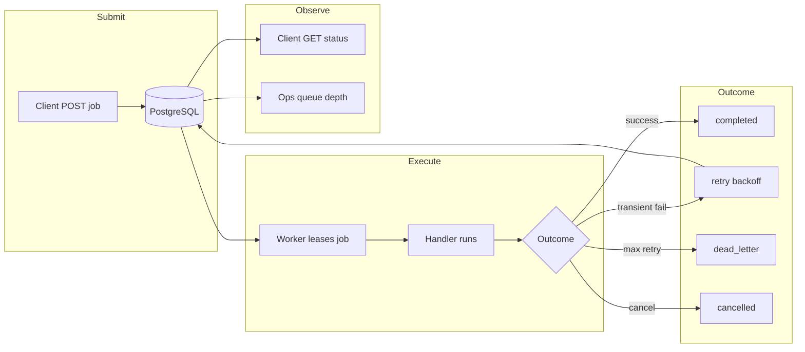
```mermaid
flowchart LR
  subgraph submit [Submit]
    A[Client POST job] --> B[(PostgreSQL)]
  end

  subgraph execute [Execute]
    B --> C[Worker leases job]
    C --> D[Handler runs]
    D --> E{Outcome}
  end

  subgraph outcome [Outcome]
    E -->|success| F[completed]
    E -->|transient fail| G[retry backoff]
    G --> B
    E -->|max retry| H[dead_letter]
    E -->|cancel| I[cancelled]
  end

  subgraph observe [Observe]
    B --> J[Client GET status]
    B --> K[Ops queue depth]
  end
```

---

## Key failure points and handling

Every failure mode below is **explicitly handled in the design**. MVP implements the rows marked **MVP**; others are Layer 2+.

| # | Failure | Detection | Handling | Status after | MVP |
|---|---------|-----------|----------|--------------|-----|
| F1 | **API crash after job accepted** | Job row missing on client poll | Write to PostgreSQL **before** returning 201; single transaction | `queued` | Yes |
| F2 | **Duplicate job submit** | Same `jobId` / idempotency key | `UNIQUE(job_id)` constraint; return existing job | unchanged | Yes |
| F3 | **Two workers grab same job** | Concurrent lease | `SELECT … FOR UPDATE SKIP LOCKED` + atomic `queued→running` CAS | one `running` | Yes |
| F4 | **Worker crash mid-job** | `lease_expires_at` passed, no complete/fail | Background sweeper or next lease attempt detects expired lease → increment attempt → requeue or DLQ | `failed`→`queued` or `dead_letter` | Yes |
| F5 | **Handler transient error** (network blip) | Worker reports `transient_failure` | Increment `attempt`; exponential backoff; requeue if `attempt < max_retry` | `failed`→`queued` | Yes |
| F6 | **Handler permanent error** (bad payload) | Worker reports `permanent_failure` | Skip retry; move straight to DLQ | `dead_letter` | Yes |
| F7 | **Max retries exhausted** | `attempt >= max_retry` | Move to `dlq_entries`; status `dead_letter` | `dead_letter` | Yes |
| F8 | **Handler exceeds timeout_sec** | Worker local timeout OR lease expiry (F4) | Cancel handler context; treat as transient failure (F5) | retry or DLQ | Yes |
| F9 | **Late complete after lease expired** | `lease_id` mismatch or expired | Reject with `409 LeaseExpired`; job already requeued — no double-complete | job requeued separately | Yes |
| F10 | **Late complete after success** | Job already `completed` | Idempotent ack or `409 AlreadyCompleted` | `completed` | Yes |
| F11 | **PostgreSQL unavailable** | Connection error | API returns `503`; client retries submit; workers backoff poll | no change | Yes |
| F12 | **Worker poll while DB slow** | Long query | Worker long-poll timeout (20s); retry poll; no job loss | no change | Yes |
| F13 | **Cancel queued job** | Ops/client cancel request | Atomic `queued→cancelled` | `cancelled` | Yes |
| F14 | **Cancel running job** | Ops cancel + lease revoke | Set `cancelled`; worker complete/fail rejected; best-effort stop | `cancelled` | Partial MVP |
| F15 | **Duplicate execution after retry** | Two workers, expired lease overlap | Exclusive `lease_id` on complete/fail; one active lease per job | single execution | Yes |
| F16 | **Long-running job outlives lease** | Lease expires while handler still running | Layer 2: heartbeat extends lease; MVP: set `timeout_sec` = lease duration | retry risk — document | Layer 2 |
| F17 | **DOKS node loss** | K8s reschedules pod | New worker pod starts; unacked jobs picked up via F4 | retry | Yes |
| F18 | **Message / job loss** | Audit query | PostgreSQL durable store; no ack until committed | — | Yes |
| F19 | **Queue backlog grows** | Ops depth metric | Visible in `GET /v1/ops/queues/{q}/status`; scale worker Deployment manually/HPA later | — | Yes |
| F20 | **Poison message loops** | Same job fails N times | DLQ after `max_retry` (F7) | `dead_letter` | Yes |

### Failure handling flow (worker path)

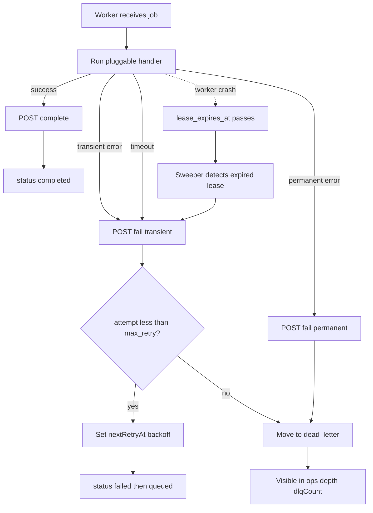
```mermaid
flowchart TD
  Start[Worker receives job] --> Run[Run pluggable handler]

  Run -->|success| Complete[POST complete]
  Complete --> Done[status completed]

  Run -->|transient error| FailT[POST fail transient]
  Run -->|timeout| FailT
  Run -->|permanent error| FailP[POST fail permanent]

  FailT --> CheckRetry{attempt less than max_retry?}
  CheckRetry -->|yes| Backoff[Set nextRetryAt backoff]
  Backoff --> Requeue[status failed then queued]
  CheckRetry -->|no| DLQ[Move to dead_letter]

  FailP --> DLQ

  Run -.->|worker crash| LeaseExpire[lease_expires_at passes]
  LeaseExpire --> Sweeper[Sweeper detects expired lease]
  Sweeper --> FailT

  DLQ --> OpsAlert[Visible in ops depth dlqCount]
```

### Guarantees we commit to (MVP)

| Guarantee | How |
|-----------|-----|
| **At-least-once delivery** | Job persisted before ack; expired leases requeued |
| **No duplicate execution** (best effort) | Exclusive lease + `lease_id` gate on complete/fail |
| **No silent job loss** | PostgreSQL durable writes; 503 on DB failure, not false 201 |
| **Failure visibility** | Status API shows `failed` + `lastError`; DLQ for poison jobs |

**Not guaranteed in MVP:** exactly-once processing (handlers should be idempotent using `executionId`); cancel of in-flight job is best-effort without heartbeat (Layer 2).

### Background reconciler (MVP — required)

A lightweight **lease sweeper** inside the API process (or cron job) runs every ~30s:

1. Find jobs where `status=running` AND `lease_expires_at < now()`
2. Treat as transient failure (F4): increment attempt, apply retry/DLQ logic, clear lease
3. Prevents jobs stuck forever after worker crash

---

## Job execution model and time constraints

### How jobs run

Jobs are **not** executed inside the API. Execution follows a strict pull model:

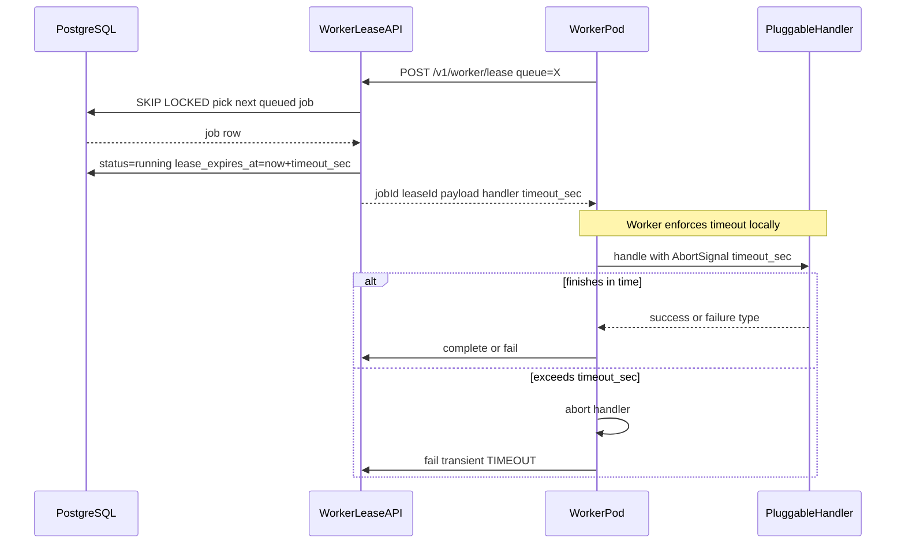
```mermaid
sequenceDiagram
  participant PG as PostgreSQL
  participant API as WorkerLeaseAPI
  participant W as WorkerPod
  participant H as PluggableHandler

  W->>API: POST /v1/worker/lease queue=X
  API->>PG: SKIP LOCKED pick next queued job
  PG-->>API: job row
  API->>PG: status=running lease_expires_at=now+timeout_sec
  API-->>W: jobId leaseId payload handler timeout_sec

  Note over W,H: Worker enforces timeout locally
  W->>H: handle with AbortSignal timeout_sec
  alt finishes in time
    H-->>W: success or failure type
    W->>API: complete or fail
  else exceeds timeout_sec
    W->>W: abort handler
    W->>API: fail transient TIMEOUT
  end
```

| Constraint | Where enforced | Default | Behavior |
|------------|----------------|---------|----------|
| **`timeout_sec`** | Worker (local `AbortSignal`) + DB (`lease_expires_at`) | 300s | Handler cancelled; lease expires; job retried or DLQ |
| **`max_retry`** | Queue engine on fail | 3 | After N attempts → `dead_letter` |
| **Retry backoff** | Queue engine (`next_retry_at`) | 10s / 30s / 90s | Job stays `failed` until backoff elapses, then `queued` |
| **Lease sweeper interval** | API background task | ~30s | Catches worker crashes where local timeout never fires |
| **Long-poll wait** | Worker lease request | 20s max | Worker blocks efficiently; no busy-spin on empty queue |
| **Handler concurrency per pod** | Worker config `WORKER_CONCURRENCY` | 1 (MVP) | Layer 2: N parallel handlers per pod with semaphores |

**MVP rule:** set `timeout_sec` ≥ expected handler duration. Layer 2 **heartbeat** extends `lease_expires_at` for long jobs without changing the handler timeout semantics.

### What is *not* a hard deadline in MVP

- **End-to-end SLA** (submit → complete): not guaranteed; depends on queue depth and worker count.
- **Retry schedule**: `next_retry_at` is earliest retry time, not exact (sweeper granularity ~30s).
- **Priority ordering**: **enforced in MVP** via PG index + `ORDER BY priority DESC` (not deferred)

---

## Scalability architecture

### What scales independently

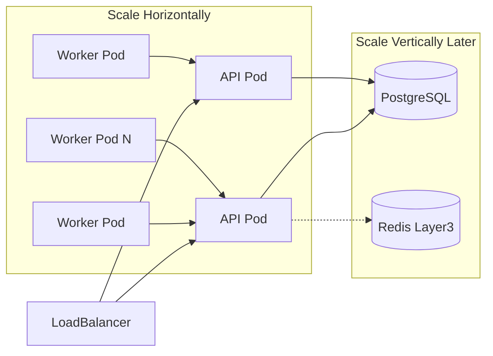
```mermaid
flowchart LR
  subgraph scale_h [Scale Horizontally]
    API1[API Pod]
    API2[API Pod]
    W1[Worker Pod]
    W2[Worker Pod]
    WN[Worker Pod N]
  end

  subgraph scale_v [Scale Vertically Later]
    PG[(PostgreSQL)]
    Redis[(Redis Layer3)]
  end

  LB[LoadBalancer] --> API1
  LB --> API2
  W1 --> API1
  W2 --> API2
  WN --> API1
  API1 --> PG
  API2 --> PG
  API1 -.-> Redis
```

| Component | Scale lever | MVP | Target at growth |
|-----------|-------------|-----|------------------|
| **Jobs / Ops API** | DOKS Deployment replicas + HPA on CPU/RPS | 1–2 pods | 5–20 pods |
| **Worker fleet** | Separate Deployment + HPA on `queue_depth` or custom metric | 1–2 pods | 10–100+ pods |
| **PostgreSQL** | Managed PG resize; read replica for status queries | 1 vCPU / 1 GB | 4+ vCPU; replica |
| **Hot queue** | Redis dequeue front (Layer 3) | Not used | Removes poll load from PG |

**Clean scaling principle:** API and workers are **stateless**; all state lives in PostgreSQL (and Redis later). Scale workers without touching API; scale API without touching workers.

### Will PostgreSQL be a bottleneck?

**Honest answer:** Yes, **eventually** — but not for the hour-1 MVP demo. PG is the correct MVP choice (durability, leases, status in one place). Know the limits and the escape path.

| PG pressure point | Symptom | MVP mitigation | Scale path (Layer 2–4) |
|-------------------|---------|----------------|------------------------|
| **Lease polling** (`SKIP LOCKED`) | Worker poll latency rises with queued rows | Index `(queue, status, created_at)`; long-poll reduces QPS; limit workers × poll rate | Redis list/ZSET as dequeue buffer; PG = source of truth only |
| **Status reads** (`GET /v1/jobs/{id}`) | API read load | Single-row PK lookup — cheap | Read replica for Jobs API reads |
| **Write on every transition** | Write IOPS cap | Batch not needed at low volume | Domain events async; archive completed jobs |
| **Connection count** | `too many connections` | Pool size 10–20 per API pod (`pg` pool) | PgBouncer sidecar; Managed PG connection limits |
| **Large queue backlog** | Dequeue scans slow | Partial index `WHERE status='queued'` | Partition `jobs` by queue or time; Redis hot queue |
| **Noisy poll storm** | Many workers, empty queue | 20s long-poll; exponential backoff on 503 | Dedicated lease service; Redis BRPOP |

**Rough MVP capacity (single `db-s-1vcpu-1gb`, 2 worker pods):**

- Submit: ~50–200 jobs/sec (write-bound)
- Process: ~10–50 jobs/sec (depends on handler duration)
- Status reads: ~500+/sec (PK lookup)

Above ~100 concurrent workers polling PG, plan **Layer 3 Redis** before adding more workers.

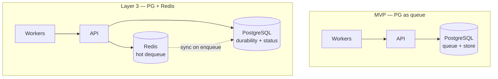
```mermaid
flowchart TB
  subgraph mvp [MVP — PG as queue]
    W1[Workers] --> API[API]
    API --> PG1[(PostgreSQL<br/>queue + store)]
  end

  subgraph layer3 [Layer 3 — PG + Redis]
    W2[Workers] --> API2[API]
    API2 --> Redis[(Redis<br/>hot dequeue)]
    API2 --> PG2[(PostgreSQL<br/>durability + status)]
    Redis -.->|sync on enqueue| PG2
  end
```

---

## Noisy neighbor prevention

"Noisy neighbor" = one tenant, queue, or job type starving or breaking others.

| Risk | Scenario | Mitigation | Layer |
|------|----------|------------|-------|
| **Queue flood** | Tenant A submits 1M jobs; Tenant B waits | Per-queue isolation; separate worker Deployments per critical queue; HPA per queue | MVP: separate `queue` names; Layer 2: dedicated worker pool labels |
| **Slow handler blocks workers** | Heavy job occupies worker | `timeout_sec` + worker `WORKER_CONCURRENCY`; separate handler pools (`worker-heavy`, `worker-fast`) | MVP: timeout; Layer 2: concurrency + pool split |
| **Priority inversion** | Low-priority backlog blocks high-priority | Priority dequeue (`ORDER BY priority DESC, created_at`) | Layer 2 |
| **Retry storm** | Failed jobs hammer DB on retry | Exponential backoff + `next_retry_at`; sweeper respects backoff | MVP |
| **API abuse** | One client hammers submit/status | Rate limit per API key / queue (`429`); payload size cap 256 KB | Layer 4 auth; MVP: basic rate limit middleware |
| **CPU/memory hog** | Handler consumes entire node | K8s `resources.limits` on worker pods; `LimitRange` in namespace | MVP in `deploy/worker.yaml` |
| **Connection hog** | Too many API pods exhaust PG connections | Connection pool max; PgBouncer | MVP: pool limits; Layer 3: PgBouncer |
| **Poison messages** | Bad job retries forever | `max_retry` → DLQ; ops `dlqCount` alert | MVP |

### MVP noisy-neighbor defaults (in K8s manifests)

```yaml
# deploy/worker.yaml — per-pod isolation
resources:
  requests: { cpu: "250m", memory: "256Mi" }
  limits:   { cpu: "1000m", memory: "512Mi" }
# Worker env
WORKER_CONCURRENCY: "1"        # one job at a time per pod in MVP
WORKER_QUEUES: "default"       # pin worker to specific queue(s)
```

**Operational rule:** run **separate worker Deployments** for latency-sensitive queues (e.g. `worker-critical` listens only to `critical` queue) so a bulk backlog on `batch` queue never blocks critical work.

---

## Worker polling mechanism

### Key point: workers do **not** poll the database directly

Workers have **no PostgreSQL connection**. They only talk to the **Worker Lease API** over HTTP. The API owns all DB access, pooling, and dequeue logic. This keeps workers stateless, swappable, and safe to scale.

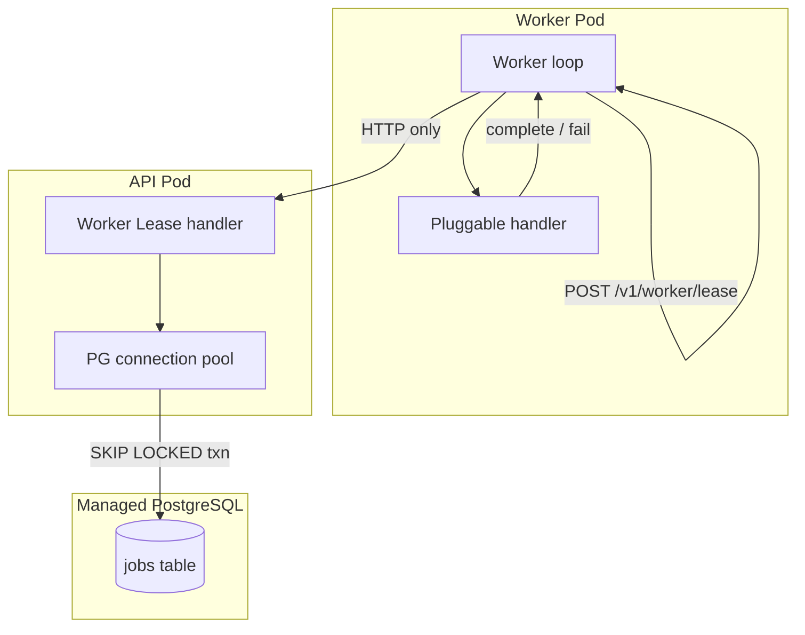
```mermaid
flowchart TB
  subgraph worker_pod [Worker Pod]
    Loop[Worker loop]
    Handler[Pluggable handler]
    Loop -->|"POST /v1/worker/lease"| Loop
    Loop --> Handler
    Handler -->|"complete / fail"| Loop
  end

  subgraph api_pod [API Pod]
    LeaseAPI[Worker Lease handler]
    Pool[PG connection pool]
    LeaseAPI --> Pool
  end

  subgraph db [Managed PostgreSQL]
    JobsTable[(jobs table)]
  end

  Loop -->|HTTP only| LeaseAPI
  Pool -->|"SKIP LOCKED txn"| JobsTable
```

### Worker loop (pseudocode)

```typescript
while (true) {
  // Long-poll: HTTP request stays open up to 20s
  const res = await fetch(`${API_URL}/v1/worker/lease`, {
    method: 'POST',
    body: JSON.stringify({ queue: 'default', workerId: WORKER_ID, waitTimeSec: 20 }),
  });

  if (res.status === 204 || res.jobs.length === 0) continue; // empty — immediately poll again

  const { jobId, leaseId, handler, payload, timeout_sec } = await res.json();

  const result = await runHandler(handler, payload, timeout_sec);

  if (result.outcome === 'success')
    await fetch(`${API_URL}/v1/worker/lease/${leaseId}/complete`, { method: 'POST' });
  else
    await fetch(`${API_URL}/v1/worker/lease/${leaseId}/fail`, {
      method: 'POST',
      body: JSON.stringify({ failureType: result.outcome, error: result.error }),
    });
}
```

Workers are **pull-based** (they ask for work), not push-based (nothing is sent to them unsolicited).

### What happens inside `POST /v1/worker/lease` (API side)

Each lease request runs one **atomic PostgreSQL transaction**:

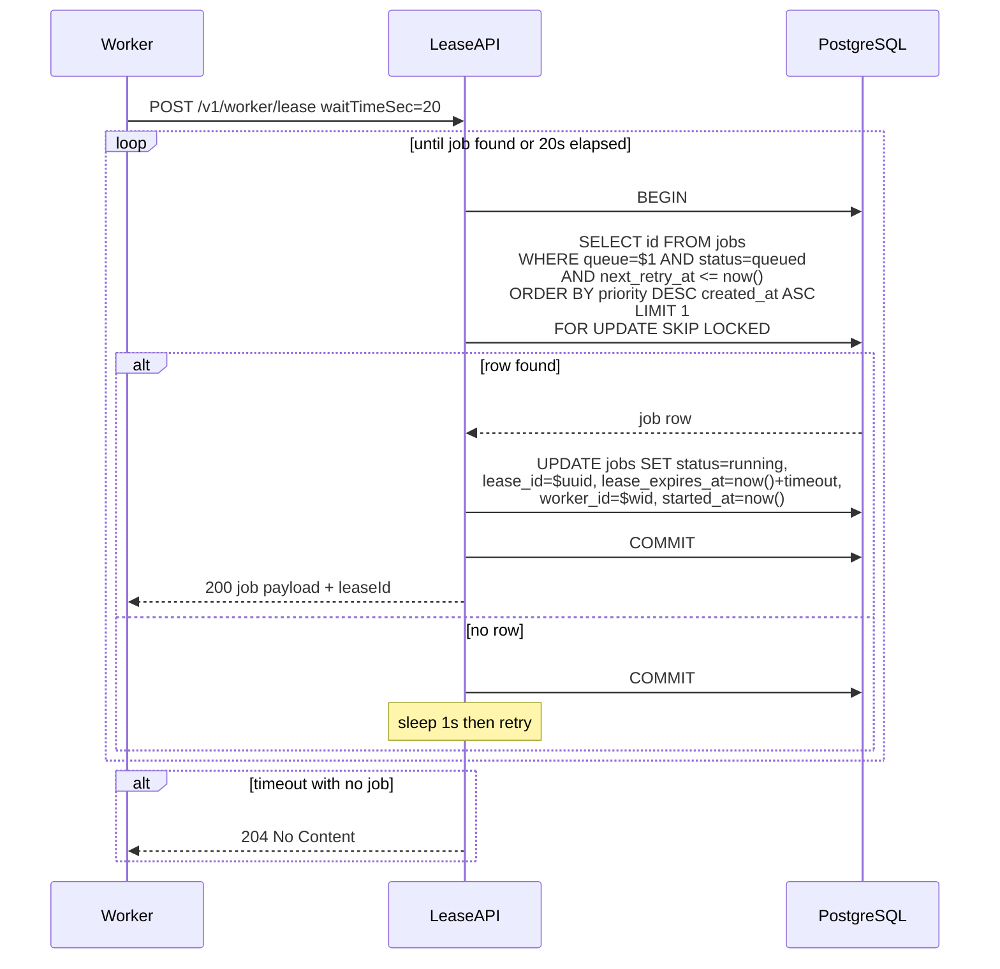
```mermaid
sequenceDiagram
  participant W as Worker
  participant API as LeaseAPI
  participant PG as PostgreSQL

  W->>API: POST /v1/worker/lease waitTimeSec=20

  loop until job found or 20s elapsed
    API->>PG: BEGIN
    API->>PG: SELECT id FROM jobs<br/>WHERE queue=$1 AND status=queued<br/>AND next_retry_at <= now()<br/>ORDER BY priority DESC created_at ASC<br/>LIMIT 1<br/>FOR UPDATE SKIP LOCKED
    alt row found
      PG-->>API: job row
      API->>PG: UPDATE jobs SET status=running,<br/>lease_id=$uuid, lease_expires_at=now()+timeout,<br/>worker_id=$wid, started_at=now()
      API->>PG: COMMIT
      API-->>W: 200 job payload + leaseId
    else no row
      API->>PG: COMMIT
      Note over API: sleep 1s then retry
    end
  end

  alt timeout with no job
    API-->>W: 204 No Content
  end
```

**Step by step:**

| Step | Action | Why |
|------|--------|-----|
| 1 | `BEGIN` transaction | Lease must be atomic — no two workers see same job |
| 2 | `SELECT … FOR UPDATE SKIP LOCKED` | Pick highest-priority queued job; **skip rows already locked** by other API threads |
| 3 | `UPDATE status = running` + set `lease_id`, `lease_expires_at` | Job leaves queue; exclusive ownership |
| 4 | `COMMIT` | Durably leased before worker receives it |
| 5 | Return JSON to worker | Worker never touches DB |

### Why `SKIP LOCKED` (not a plain `SELECT`)?

When 10 workers poll at once, 10 API threads run the same dequeue query concurrently:

| Without SKIP LOCKED | With SKIP LOCKED |
|---------------------|------------------|
| Thread A locks row 1 | Thread A locks row 1 |
| Thread B **waits** on row 1 | Thread B **skips** row 1, locks row 2 |
| Thread C waits… | Thread C skips 1 & 2, locks row 3 |
| Serial bottleneck | **Parallel dequeue** — each worker gets a different job |

This is the core mechanism that makes **many workers polling PostgreSQL** work without a separate message broker in MVP.

### Long polling (not busy-spin)

When the queue is **empty**, the API does **not** return immediately on every request (that would hammer PG). Instead:

- Worker sends `waitTimeSec: 20`
- API holds the HTTP connection open, retrying the `SKIP LOCKED` query every **~1 second**
- If a job arrives (client submits), the next retry finds it and returns **200**
- If 20s pass with no job, return **204 No Content**; worker immediately opens a new lease request

```
Empty queue:  ~1 PG query/sec per waiting worker  (not 100/sec busy-poll)
Busy queue:   1 transaction per job leased         (immediate return)
```

**Layer 2 upgrade:** PostgreSQL `LISTEN job_enqueued` — API wakes instantly on insert instead of 1s polling loop.

### After the worker gets a job

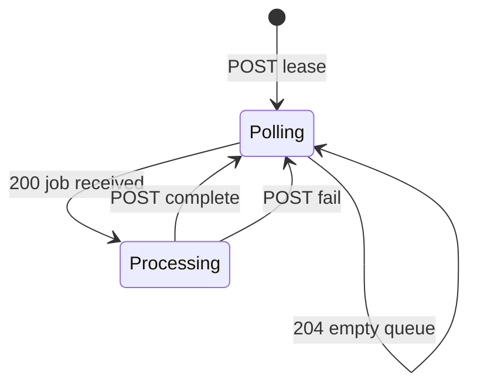
```mermaid
stateDiagram-v2
  [*] --> Polling: POST lease
  Polling --> Processing: 200 job received
  Processing --> Polling: POST complete
  Processing --> Polling: POST fail
  Polling --> Polling: 204 empty queue
```

The worker **does not poll again** until it reports `complete` or `fail`. One in-flight job per concurrency slot (`WORKER_CONCURRENCY=1` in MVP).

### Complete / fail — closing the loop

| Call | DB effect |
|------|-----------|
| `POST …/complete` | Verify `lease_id` matches → `status=completed`, clear lease |
| `POST …/fail` | Verify `lease_id` → increment attempt → retry backoff or `dead_letter` |
| Wrong/expired `lease_id` | `409 LeaseExpired` — job already reclaimed by sweeper |

### Why this foundation scales (and where it breaks)

| Scale | Mechanism holds? | Mitigation |
|-------|------------------|------------|
| 2–10 workers | Yes | Long-poll + index |
| 10–50 workers | Mostly | Connection pool; partial index |
| 50–100+ workers | Dequeue TX contention rises | Layer 3: Redis `ZPOPMAX` as front buffer; PG for durability only |
| 1000 jobs queued | Accept fast (INSERT); drain limited by worker count | HPA scales worker pods |

**Layer 3 Redis path (future):** enqueue writes to Redis ZSET **and** PG; lease pops from Redis first (O(log N), no row locks); PG updated async. Workers still call the same HTTP API — **worker code unchanged**.

---

## Pluggable handler architecture

Handlers are **plain TypeScript modules** registered at worker startup. No dynamic classloading or separate plugin binaries in MVP — add a file, register it, rebuild the worker image.

### How a handler plugs in

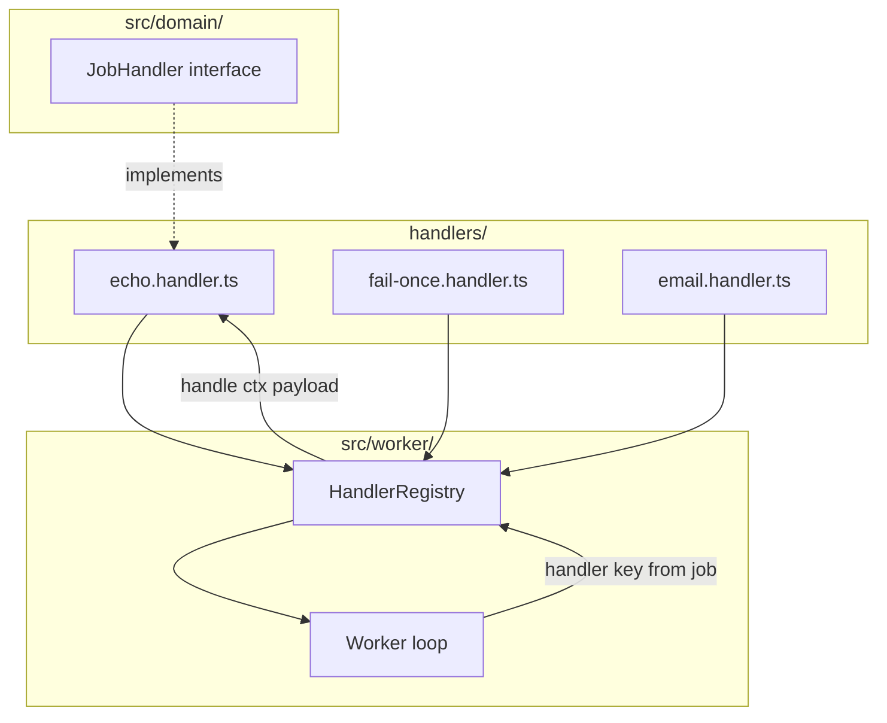
```mermaid
flowchart TB
  subgraph handlers_pkg [handlers/]
    Echo[echo.handler.ts]
    FailOnce[fail-once.handler.ts]
    Email[email.handler.ts]
  end

  subgraph worker_svc [src/worker/]
    Registry[HandlerRegistry]
    Loop[Worker loop]
    Registry --> Loop
  end

  subgraph domain [src/domain/]
    Port[JobHandler interface]
  end

  Echo --> Registry
  FailOnce --> Registry
  Email --> Registry
  Port -.->|implements| Echo
  Loop -->|"handler key from job"| Registry
  Registry -->|"handle ctx payload"| Echo
```

### 1. Define the port (`src/domain/job-handler.ts`)

```typescript
export interface JobContext {
  jobId: string;
  leaseId: string;
  executionId: string;
  attempt: number;
  queue: string;
  signal: AbortSignal;  // cancelled when timeout_sec exceeded
}

export interface HandlerResult {
  outcome: 'success' | 'transient_failure' | 'permanent_failure';
  error?: { code: string; message: string };
}

export interface JobHandler {
  readonly handlerType: string;  // must match job.handler on submit
  handle(ctx: JobContext, payload: unknown): Promise<HandlerResult>;
}
```

### 2. Implement a handler (`handlers/echo.handler.ts`)

```typescript
export const echoHandler: JobHandler = {
  handlerType: 'echo',
  async handle(_ctx, payload) {
    // business logic here
    return { outcome: 'success' };
  },
};
```

### 3. Register at worker startup (`src/worker/registry.ts`)

```typescript
import { echoHandler } from '../../handlers/echo.handler';
import { failOnceHandler } from '../../handlers/fail-once.handler';

const handlers = new Map<string, JobHandler>();

export function registerHandler(h: JobHandler) {
  handlers.set(h.handlerType, h);
}

export function getHandler(type: string): JobHandler {
  const h = handlers.get(type);
  if (!h) throw new Error(`Unknown handler: ${type}`);
  return h;
}

// Called once in worker main()
registerHandler(echoHandler);
registerHandler(failOnceHandler);
```

### 4. Worker dispatches by `handler` field from leased job

```typescript
const job = await leaseJob(queue);
const handler = getHandler(job.handler);           // e.g. "echo"
const result = await handler.handle(ctx, job.payload);
await reportOutcome(job.leaseId, result);
```

### Client submits with handler key

```json
POST /v1/jobs
{
  "queue": "default",
  "handler": "echo",
  "payload": { "message": "hello" },
  "priority": "high",
  "max_retry": 3,
  "timeout_sec": 60
}
```

The API validates `handler` against a **known-handler list** (shared config or compile-time list in MVP) before accepting the job.

### Adding a new handler (developer workflow)

| Step | Action |
|------|--------|
| 1 | Create `handlers/my-job.handler.ts` implementing `JobHandler` |
| 2 | Call `registerHandler(myJobHandler)` in `registry.ts` |
| 3 | Add handler name to API allowlist (env `ALLOWED_HANDLERS=echo,fail-once,my-job`) |
| 4 | Rebuild + redeploy **worker** image (and API if allowlist changed) |

**Layer 2:** split handlers into optional Docker image tags (`worker-email`, `worker-batch`) so teams deploy handler pools independently.

**Layer 4:** K8s ConfigMap lists enabled handlers per worker Deployment — no API code change for worker-only handlers.

### Handler outcome → queue engine

| Handler returns | Worker calls | Queue engine does |
|-----------------|--------------|-------------------|
| `success` | `POST …/complete` | `status = completed` |
| `transient_failure` | `POST …/fail` transient | Backoff retry or DLQ |
| `permanent_failure` | `POST …/fail` permanent | Immediate DLQ |
| Throws / timeout | Worker catches → `fail` transient | Same as transient |

Handlers stay **pure business logic** — retry, lease, and DLQ are platform concerns.

---

## Priority scheduling

**No in-process heap** in MVP or v1. A heap only works inside a single process; workers and API pods are distributed — each would hold a different heap with no shared view.

Instead we use a **durable, shared priority ordering** strategy:

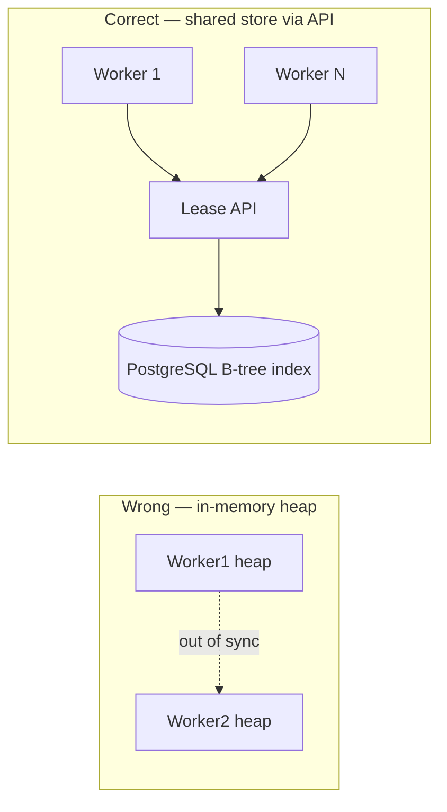
```mermaid
flowchart LR
  subgraph wrong [Wrong — in-memory heap]
    H1[Worker1 heap] 
    H2[Worker2 heap]
    H1 -.->|out of sync| H2
  end

  subgraph right [Correct — shared store via API]
    W1[Worker 1] --> API[Lease API]
    W2[Worker N] --> API
    API --> PG[(PostgreSQL B-tree index)]
  end
```

| Approach | How it works | When |
|----------|--------------|------|
| **MVP (hour 1)** | PostgreSQL composite index + `ORDER BY priority DESC, created_at ASC` in lease query | Built into foundation — not deferred |
| **Layer 3** | Redis **ZSET** score = `(priority << 32) + timestamp` for O(log N) pop | When PG poll becomes hot |
| **Alternative** | 4 physical sub-queues (`critical`, `high`, `normal`, `low`) — dequeue checks in order | Simple; good for noisy-neighbor isolation |

**Priority values (stored as integer):**

| Label | Weight |
|-------|--------|
| `critical` | 4 |
| `high` | 3 |
| `normal` | 2 |
| `low` | 1 |

**MVP lease SQL (foundation — ship in hour 1):**

```sql
-- Index created in migration (critical for 1000-job bursts)
CREATE INDEX idx_jobs_dequeue ON jobs (queue, status, priority DESC, created_at ASC)
  WHERE status = 'queued';

SELECT * FROM jobs
WHERE queue = $1 AND status = 'queued'
  AND (next_retry_at IS NULL OR next_retry_at <= now())
ORDER BY priority DESC, created_at ASC
LIMIT 1
FOR UPDATE SKIP LOCKED;
```

PostgreSQL's **B-tree index** on `(priority DESC, created_at ASC)` gives the same scheduling semantics as a heap pop — **O(log N) seek**, not a full table scan — without any in-memory heap in application code.

**Layer 3 Redis ZSET** (when PG dequeue is the bottleneck): enqueue `ZADD queue:default {score} {jobId}` where `score = priority_weight * 1e12 + created_at_ms`; workers `ZPOPMAX` — structurally equivalent to a shared distributed priority queue.

---

## Autoscaling and 1000-job burst

### What happens when 1000 jobs arrive at once?

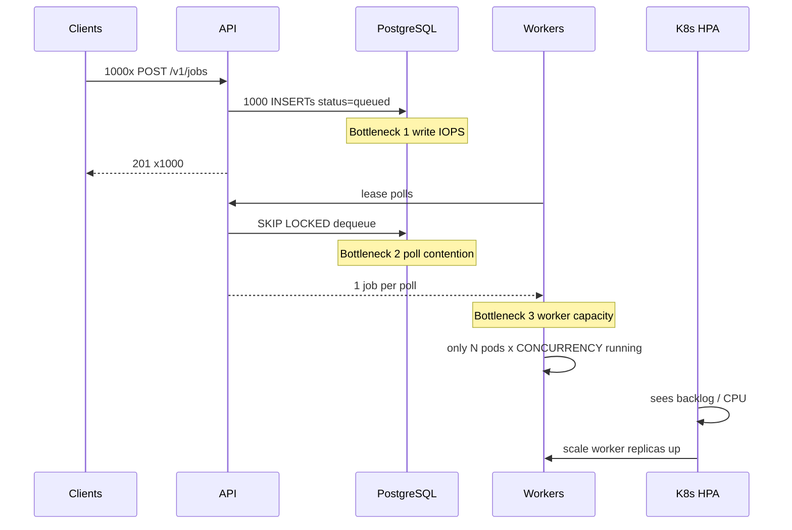
```mermaid
sequenceDiagram
  participant C as Clients
  participant API as API
  participant PG as PostgreSQL
  participant W as Workers
  participant HPA as K8s HPA

  C->>API: 1000x POST /v1/jobs
  API->>PG: 1000 INSERTs status=queued
  Note over PG: Bottleneck 1 write IOPS
  API-->>C: 201 x1000

  W->>API: lease polls
  API->>PG: SKIP LOCKED dequeue
  Note over PG: Bottleneck 2 poll contention
  API-->>W: 1 job per poll

  Note over W: Bottleneck 3 worker capacity
  W->>W: only N pods x CONCURRENCY running

  HPA->>HPA: sees backlog / CPU
  HPA->>W: scale worker replicas up
```

### Bottleneck map (1000 jobs, MVP infra)

| Stage | Bottleneck | Symptom | MVP foundation (hour 1) | Auto-scale path |
|-------|------------|---------|-------------------------|-----------------|
| **Submit** | PG write rate (~100–500 INSERT/s on 1 vCPU) | Slow 201 responses | Batch insert optional; connection pool; return 202 if needed later | Scale API pods (HPA on CPU/RPS) |
| **Queue storage** | Row count in `jobs` table | Larger index | Partial index `WHERE status='queued'`; archive completed jobs later | PG vertical resize |
| **Dequeue** | `SKIP LOCKED` + `ORDER BY priority` | Lease latency spikes | **Composite index from day 1**; 20s long-poll reduces empty polls | Redis ZSET (Layer 3); more API pods |
| **Execution** | Worker pod count × `WORKER_CONCURRENCY` | Queue depth stays high while workers catch up | Separate worker Deployment; resource limits | **HPA on queue depth** (Layer 2) |
| **Complete/fail** | PG UPDATE per job | Write IOPS | Single UPDATE per transition; pooled connections | Same as submit |
| **Status polls** | Read QPS from clients | API CPU | PK lookup on `job_id` — cheap | API HPA; read replica later |
| **Sweeper** | Scan `running` expired leases | CPU on API | Index on `(status, lease_expires_at)` | Dedicated reconciler pod |

**Throughput math (MVP defaults):**

- 2 worker pods × `WORKER_CONCURRENCY=1` × ~5s avg handler = **~0.4 jobs/sec processed**
- 1000 jobs → **~40 min** to drain unless workers scale up
- 10 worker pods → **~2 jobs/sec** → ~8 min drain

So the system **accepts** 1000 jobs immediately (durable in PG); **processing** scales with worker count.

### Automatic scaling plan

| Component | MVP (hour 1) | Layer 2 (auto) | Layer 4 (production) |
|-----------|--------------|----------------|----------------------|
| **Workers** | Fixed replicas=2 in manifest; manual `kubectl scale` | **HPA** min=2 max=20 on custom metric `queue_depth` or CPU | KEDA scaler on Prometheus `jobqueue_depth{status="queued"}` |
| **API** | Fixed replicas=1–2 | HPA on CPU > 70% or RPS | DO Load Balancer + multi-replica |
| **PostgreSQL** | Manual resize via `doctl databases resize` | Alert when connections > 80% | Read replica; PgBouncer; Redis hot queue |

**HPA manifest stub (include in hour-1 `deploy/` — wire metric in Layer 2):**

```yaml
# deploy/worker-hpa.yaml
apiVersion: autoscaling/v2
kind: HorizontalPodAutoscaler
metadata:
  name: worker-hpa
spec:
  scaleTargetRef:
    apiVersion: apps/v1
    kind: Deployment
    name: worker
  minReplicas: 2
  maxReplicas: 20
  metrics:
    - type: Resource
      resource:
        name: cpu
        target:
          type: Utilization
          averageUtilization: 70
    # Layer 2: replace/add external metric from ops API
    # - type: External
    #   external:
    #     metric: { name: jobqueue_queued_depth }
    #     target: { type: AverageValue, averageValue: "10" }
```

**Layer 2 custom-metric loop:** ops API exposes `queued` depth → Prometheus gauge → HPA/KEDA scales workers when `depth / replicas > 10`.

### Hour-1 foundation checklist (scale-ready)

Ship these in the first hour even under time pressure — low cost, high payoff:

| # | Foundation item | Why |
|---|-----------------|-----|
| 1 | `priority` column + **dequeue composite index** | Priority + fast dequeue at 1000 rows |
| 2 | Partial index `WHERE status='queued'` | Dequeue never scans completed rows |
| 3 | Index on `(status, lease_expires_at)` | Sweeper stays fast as table grows |
| 4 | Connection pool (`max: 20`) on API | Survives submit burst without exhausting PG |
| 5 | Long-poll lease (20s) | Workers don't DDOS PG on empty queue |
| 6 | Separate **api** and **worker** Deployments | Scale execution without scaling API |
| 7 | `WORKER_CONCURRENCY` env var | Turn to 5+ per pod without code change |
| 8 | HPA manifest (CPU-based first) | Flip on auto-scale immediately |
| 9 | Ops `depthByStatus` endpoint | HPA + operators see backlog |
| 10 | `QueuePort` interface in domain | Swap PG dequeue → Redis later without rewrite |

---

## Operational metrics and monitoring

Monitoring is split by **audience** — end users, operators, and the platform (autoscaling).

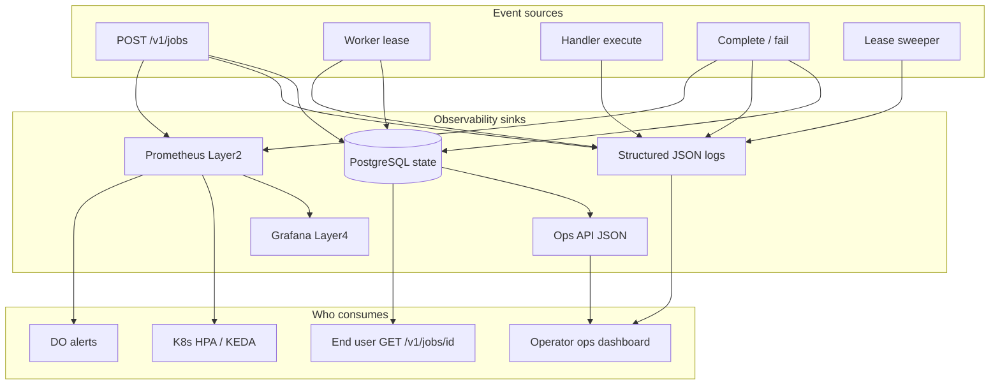
```mermaid
flowchart TB
  subgraph data [Event sources]
    Submit[POST /v1/jobs]
    Lease[Worker lease]
    Handler[Handler execute]
    Complete[Complete / fail]
    Sweeper[Lease sweeper]
  end

  subgraph sinks [Observability sinks]
    PG[(PostgreSQL state)]
    Logs[Structured JSON logs]
    OpsAPI[Ops API JSON]
    Prom[Prometheus Layer2]
    Grafana[Grafana Layer4]
  end

  subgraph consumers [Who consumes]
    User[End user GET /v1/jobs/id]
    Operator[Operator ops dashboard]
    HPA[K8s HPA / KEDA]
    Alerts[DO alerts]
  end

  Submit --> PG
  Lease --> PG
  Complete --> PG
  Submit --> Logs
  Lease --> Logs
  Handler --> Logs
  Complete --> Logs
  Sweeper --> Logs

  PG --> OpsAPI
  PG --> User
  Logs --> Operator
  OpsAPI --> Operator
  Prom --> Grafana
  Prom --> HPA
  Prom --> Alerts
  Complete --> Prom
  Submit --> Prom
```

### End user (control plane) — job-level visibility

Users **do not** see infra metrics. They poll:

**`GET /v1/jobs/{jobId}`** — per-job status, attempt, errors, timestamps.

| User question | Answer from API |
|---------------|---------------|
| Is my job waiting? | `status: queued` + position N/A in MVP (Layer 2: approximate queue rank) |
| Is it running? | `status: running`, `workerId`, `startedAt` |
| Did it fail? | `status: failed`, `lastError`, `nextRetryAt` |
| Is it dead? | `status: dead_letter`, `lastError` |
| Did it finish? | `status: completed`, `completedAt` |

Async submit model: client gets **`201` + `jobId` immediately** — no blocking on execution. Client polls status or checks later.

### Operator — queue and fleet health

**MVP:** Ops JSON endpoints + grep logs.

**Layer 2+:** Prometheus + Grafana dashboards.

| Signal | Source | Alert when |
|--------|--------|------------|
| Backlog growing | `depthByStatus.queued` | > 500 for 5 min |
| Stuck jobs | `oldestQueuedJobAgeSec` | > 300s |
| Poison messages | `depthByStatus.dead_letter` | > 0 |
| Workers saturated | `jobsInFlight ≈ replicas × concurrency` | scale up |
| Handler slowness | `handler_duration p95` | > timeout_sec × 0.8 |
| PG dequeue slow | `lease_latency p95` | > 500ms → plan Redis |
| Worker crashes | `sweeper_reclaimed_total` spike | investigate pods |

### Platform — structured logs (MVP, every transition)

```json
{
  "event": "job.completed",
  "jobId": "abc-123",
  "queue": "default",
  "handler": "echo",
  "status": "completed",
  "priority": 3,
  "attempt": 1,
  "workerId": "worker-pod-7f3a",
  "leaseId": "lease-uuid",
  "durationMs": 142,
  "timestamp": "2026-07-04T09:00:00Z"
}
```

Ship logs to DO Log Forwarding / Grafana Loki in Layer 4.

---

## Control plane scaling (async submit burst)

When **many users submit jobs asynchronously** (`POST /v1/jobs` → immediate 201), load hits the **API + PostgreSQL write path** — not workers. Workers scale execution; the control plane scales **acceptance**.

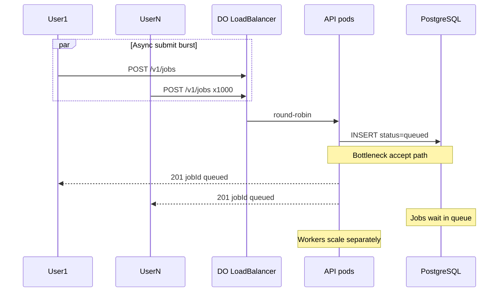
```mermaid
sequenceDiagram
  participant U1 as User1
  participant U2 as UserN
  participant LB as DO LoadBalancer
  participant API as API pods
  participant PG as PostgreSQL

  par Async submit burst
    U1->>LB: POST /v1/jobs
    U2->>LB: POST /v1/jobs x1000
  end

  LB->>API: round-robin
  API->>PG: INSERT status=queued
  Note over API,PG: Bottleneck accept path
  API-->>U1: 201 jobId queued
  API-->>U2: 201 jobId queued

  Note over PG: Jobs wait in queue
  Note over API: Workers scale separately
```

### Accept path vs execute path

| Path | Endpoint | Scales with | Bottleneck |
|------|----------|-------------|------------|
| **Accept (control plane)** | `POST /v1/jobs` | API pod HPA | PG INSERT rate, API CPU, connection pool |
| **Status (control plane)** | `GET /v1/jobs/{id}` | API pod HPA | Cheap PK reads; read replica later |
| **Execute** | Worker lease + handler | Worker pod HPA | Handler duration, worker count |

**Key insight:** 1000 users each submitting 10 jobs = 10,000 **async accepts**. All succeed fast if API + PG keep up. Processing lag shows in `depthByStatus.queued` — workers scale to drain, users poll status.

### Control plane scaling strategy

| Layer | Mechanism |
|-------|-----------|
| **MVP** | 2 API replicas behind DO Load Balancer; PG connection pool (max 20/pod); fast 201 response after single INSERT |
| **Layer 2** | API HPA: scale 2→10 pods on CPU > 70% or `http_requests_rate` |
| **Layer 3** | PgBouncer sidecar if connections exhaust; read replica for `GET /v1/jobs` |
| **Layer 4** | Rate limit per API key (`429`); optional async ack `202 Accepted` + webhook on completion |

### API HPA manifest (hour-1 stub in `deploy/api-hpa.yaml`)

```yaml
apiVersion: autoscaling/v2
kind: HorizontalPodAutoscaler
metadata:
  name: api-hpa
spec:
  scaleTargetRef:
    apiVersion: apps/v1
    kind: Deployment
    name: api
  minReplicas: 2
  maxReplicas: 10
  metrics:
    - type: Resource
      resource:
        name: cpu
        target:
          type: Utilization
          averageUtilization: 70
```

### Submit burst — what we guarantee

| Guarantee | MVP behavior |
|-----------|--------------|
| **Accept is non-blocking** | 201 returned after durable PG INSERT (~5–20ms typical) |
| **No job loss on accept** | Transaction committed before 201 |
| **Overload protection** | Layer 4 rate limit; MVP returns 503 if PG unavailable (client retries) |
| **Fairness under burst** | Jobs ordered by `priority` + FIFO in queue; not by submit HTTP arrival after accept |

### Two HPAs working together

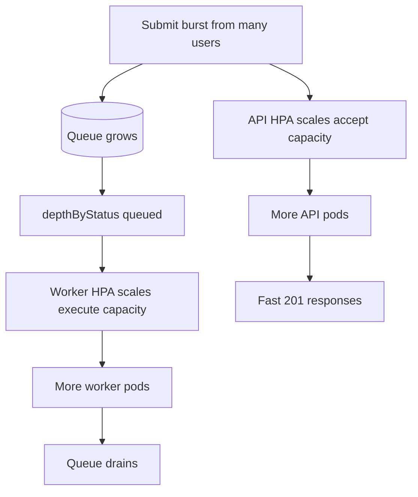
```mermaid
flowchart TB
  Burst[Submit burst from many users] --> APIHPA[API HPA scales accept capacity]
  Burst --> PG[(Queue grows)]
  PG --> Depth[depthByStatus queued]
  Depth --> WorkerHPA[Worker HPA scales execute capacity]
  APIHPA --> APIScale[More API pods]
  WorkerHPA --> WorkerScale[More worker pods]
  APIScale --> Fast201[Fast 201 responses]
  WorkerScale --> Drain[Queue drains]
```

| HPA target | Scales when | Handles |
|------------|-------------|---------|
| **api-hpa** | API CPU / RPS high | Many concurrent `POST /v1/jobs` + status polls |
| **worker-hpa** | Queue depth / worker CPU high | Backlog of `queued` jobs |

Users get fast async acceptance; workers catch up independently — **control plane and execution plane scale separately**.

---

## Operational metrics (reference)

Metrics via **Ops API JSON** + **structured logs** — enough to operate and feed HPA in Layer 2.

**`GET /v1/ops/queues/{queue}/status`**

```json
{
  "depthByStatus": { "queued": 847, "running": 12, "failed": 3, "dead_letter": 2 },
  "depthByPriority": { "critical": 5, "high": 100, "normal": 700, "low": 42 },
  "oldestQueuedJobAgeSec": 184,
  "processingRate1m": 4.2,
  "submitRate1m": 120.0
}
```

**`GET /v1/ops/workers/utilization`** (Layer 2 full; MVP stub with active count)

```json
{
  "workerReplicas": 2,
  "jobsInFlight": 12,
  "jobsCompleted1m": 38,
  "jobsFailed1m": 2,
  "avgProcessingTimeSec": 6.1
}
```

**Structured log fields (every transition):**

`jobId`, `queue`, `status`, `priority`, `attempt`, `workerId`, `leaseId`, `durationMs`, `errorCode`

### Layer 2 — Prometheus metrics (feeds HPA + dashboards)

Expose `GET /metrics` (Prometheus format) from API:

| Metric | Type | Use |
|--------|------|-----|
| `jobqueue_jobs_submitted_total` | Counter | Submit rate |
| `jobqueue_jobs_completed_total` | Counter | Throughput |
| `jobqueue_jobs_failed_total` | Counter | Error rate |
| `jobqueue_jobs_dlq_total` | Counter | Poison jobs |
| `jobqueue_depth{queue,status}` | Gauge | **HPA scaling signal** |
| `jobqueue_depth{queue,priority}` | Gauge | Priority backlog |
| `jobqueue_lease_latency_seconds` | Histogram | Dequeue perf (PG bottleneck detector) |
| `jobqueue_handler_duration_seconds` | Histogram | Handler slowness |
| `jobqueue_oldest_queued_age_seconds` | Gauge | SLA alert |
| `jobqueue_sweeper_reclaimed_total` | Counter | Worker crash rate |

### Layer 4 — full observability

- Grafana dashboard on DOKS (queue depth, processing rate, DLQ, p95 handler time)
- DO Monitoring alerts: `oldestQueuedJobAgeSec > 300`, `dlqCount > 0`, `queued depth > 500`
- OpenTelemetry traces: submit → lease → handler → complete (deferred)

### Metrics → scaling closed loop

```mermaid
flowchart LR
  Jobs[Job transitions] --> Counters[Prometheus metrics]
  Counters --> Grafana[Grafana dashboard]
  Counters --> HPA[K8s HPA or KEDA]
  HPA --> Workers[Worker replicas]
  Workers --> Jobs
  OpsAPI[Ops JSON API] --> Operators[Operator alerts]
  Counters --> OpsAPI
```

---

Testing is layered: fast tests in CI on every PR; smoke on DO after deploy; load/chaos when time permits.

### Test pyramid

```mermaid
flowchart TB
  E2E_DO["E2E on DO smoke<br/>scripts/e2e-do.sh"]
  Integration["Integration docker-compose<br/>tests/integration/"]
  Unit["Unit tests<br/>domain + retry + state machine"]
  Chaos["Chaos optional Layer2<br/>kill worker pod"]

  Unit --> Integration --> E2E_DO
  Integration --> Chaos
```

### Layer 1 — Unit tests (CI, every PR)

| Test file | Covers |
|-----------|--------|
| `job-state-machine.test` | Valid/invalid transitions `queued→running→completed`, etc. |
| `retry-policy.test` | Backoff calc, `max_retry` → DLQ decision |
| `lease-validation.test` | Reject complete with wrong/expired `lease_id` |

### Layer 2 — Integration tests (CI, docker-compose)

Run via `.github/workflows/ci.yml` against `docker-compose up`:

| Test | Flow | Asserts |
|------|------|---------|
| **happy-path** | submit → worker leases → handler succeeds → complete | status `completed` |
| **transient-retry** | handler fails once then succeeds | status `completed`, `attempt=2` |
| **dlq** | handler always transient fail, `max_retry=2` | status `dead_letter` |
| **idempotent-submit** | same `jobId` twice | one row, same response |
| **lease-expiry** | worker leases, never completes; wait for sweeper | job requeued, retried |
| **cancel-queued** | submit → cancel | status `cancelled` |
| **ops-depth** | submit 3 jobs, complete 1 | depth counts correct |
| **duplicate-exec** | two workers race same job | exactly one `running` lease |

```bash
# CI command
docker compose up -d --wait
npm test -- --runInBand tests/integration/
```

### Layer 3 — E2E on DigitalOcean (post-deploy smoke)

`scripts/e2e-do.sh` runs after `./scripts/deploy.sh`:

1. `POST /v1/jobs` against Ingress URL
2. Poll `GET /v1/jobs/{id}` until `completed` (timeout 120s)
3. `GET /v1/ops/queues/default/status` — depth 0
4. Submit `fail-handler` job → assert `dead_letter` after retries
5. Exit non-zero on any failure (CI deploy gate)

### Layer 4 — Scalability / chaos tests (if time permits)

| Test | Method | Validates |
|------|--------|-------------|
| **Throughput** | `scripts/load-test.sh` — 100 jobs, 5 workers | All complete; p95 latency recorded |
| **Worker scale** | `kubectl scale deployment/worker --replicas=5` | Queue drains faster; no dup exec |
| **Worker kill** | `kubectl delete pod -l app=worker` mid-job | Lease sweeper recovers; job completes on retry |
| **API scale** | Scale API to 3 replicas | Submit + status still consistent |
| **PG stress** | 500 queued jobs, measure lease latency | Baseline before Redis Layer 3 |

### CI workflow structure

```yaml
# .github/workflows/ci.yml
jobs:
  unit:       # npm test src/domain src/application
  integration: # docker compose + tests/integration
  build:      # docker build api + worker
  deploy:     # main only: doctl + deploy.sh + e2e-do.sh
```

### Success criteria — testing

**MVP (hour 1):**

- [ ] 1 integration test: happy-path submit → complete
- [ ] CI runs on PR via GitHub Actions

**Layer 2 (if time):**

- [ ] Full integration matrix (8 tests above)
- [ ] `e2e-do.sh` smoke on DO after deploy

**Layer 4 (later):**

- [ ] Load test script + worker kill chaos test
- [ ] Document PG baseline metrics before Redis migration

---

## 1-hour MVP strategy (build in layers)

**Goal:** Ship a working end-to-end demo in ~60 minutes. Architecture stays extensible via interfaces; infra stays minimal.

### What ships in the first hour (non-negotiable)

| # | Feature | MVP implementation |
|---|---------|-------------------|
| 1 | Submit job | `POST /v1/jobs` — `jobId`, `priority`, `max_retry`, `timeout_sec`, `handler`, `payload` |
| 2 | Job status | `GET /v1/jobs/{jobId}` — `queued`, `running`, `failed`, `dead_letter`, `completed`, `cancelled` |
| 3 | Independent worker | Separate process/entrypoint (`worker/main`); polls Worker Lease API — **not embedded in API** |
| 4 | Pluggable handler | `JobHandler` interface + one example handler (`echo`, `fail-once`, etc.) |
| 5 | Retry + DLQ | Transient fail → requeue until `max_retry`; then `dead_letter` |
| 6 | At-least-once + no dup exec | PostgreSQL `FOR UPDATE SKIP LOCKED` lease + unique `jobId` + `lease_id` on complete/fail |
| 7 | Ops basics | `GET /v1/ops/queues/{queue}/status` (depth by status) + `POST /v1/ops/jobs/{jobId}/cancel` |
| 8 | CI | GitHub Actions — lint + **one** integration test covering submit → worker → complete |
| 9 | **DO infra** | Provision via **`doctl`** script; deploy API + worker to DOKS + Managed PostgreSQL |

### What we deliberately skip in hour 1

| Cut | Reason | Add in |
|-----|--------|--------|
| Redis | PG `SKIP LOCKED` is enough for MVP | Layer 3 |
| Auth / JWT | Hardcoded dev token or no auth | Layer 4 |
| Heartbeat / visibility API | Fixed lease = `timeout_sec`; expired lease → retry | Layer 2 |
| Priority ordering | **Included in MVP** — composite index + ORDER BY on lease | Layer 3: Redis ZSET if PG hot |
| Batch submit/cancel | Single-job APIs only | Layer 2 |
| Worker utilization metrics | Queue depth only | Layer 3 |
| OpenAPI spec doc | Inline types + README | Layer 2 |
| Monorepo packages split | Single repo, module folders (`domain/`, `api/`, `worker/`) | Layer 3 refactor OK |
| Terraform / Pulumi | `doctl` shell script is faster for hour 1 | Layer 4 refactor to IaC |

### Time budget (~60 min) — code + DO infra in parallel

**Critical:** DOKS + Managed PG take ~5–10 min to provision. Kick off `scripts/provision.sh` **immediately** (minute 0), then build app while infra creates.

```mermaid
gantt
  title OneHour MVP Build Order
  dateFormat X
  axisFormat %M min

  section Infra_async
  doctl_provision_DOKS_PG_DOCR     :0, 12
  section Foundation
  Scaffold_schema_dockerfile         :0, 10
  section Core
  Submit_and_status_API              :10, 25
  Worker_lease_complete_fail         :25, 40
  Retry_DLQ_lease_dedup              :40, 50
  section Finish
  Ops_CI_kubectl_deploy              :50, 60
```

| Block | Minutes | Deliverable |
|-------|---------|-------------|
| 0 | 0–10 | **`scripts/provision.sh`** (doctl) starts; app scaffold + migrations + Dockerfile |
| 1 | 10–25 | Jobs API: submit + status |
| 2 | 25–40 | Worker process + lease/complete/fail + example handler |
| 3 | 40–50 | Fail → retry → DLQ; lease prevents double complete |
| 4 | 50–60 | Ops depth + cancel; CI workflow; **`kubectl apply`** + smoke test on DO |

### Stretch layers (only if time remains)

**Layer 2 (~+20–30 min):** priority dequeue, heartbeat, visibility endpoint, client cancel.

**Layer 3 (~+30 min):** Redis (`doctl databases create --engine redis`); worker utilization ops API.

**Layer 4 (later session):** Terraform IaC, HPA tuning, real auth, observability, delayed/recurring jobs.

---

## DigitalOcean infrastructure — CLI tooling

### Primary CLI: `doctl`

**[`doctl`](https://docs.digitalocean.com/reference/doctl/)** is the official DigitalOcean CLI. It is the main tool used to create and manage all MVP infra programmatically.

**Prerequisites (one-time):**

```bash
# Install doctl (Linux)
cd ~ && wget https://github.com/digitalocean/doctl/releases/download/v1.163.0/doctl-1.163.0-linux-amd64.tar.gz
tar xf doctl-1.163.0-linux-amd64.tar.gz && sudo mv doctl /usr/local/bin

# Authenticate (requires DIGITALOCEAN_ACCESS_TOKEN env var or paste at prompt)
doctl auth init

# Optional: assign to a project
doctl projects list
```

**Supporting CLIs (used after doctl creates the cluster):**

| Tool | Role |
|------|------|
| **`doctl`** | Create DOCR, Managed PostgreSQL, DOKS cluster, DB firewall/trusted sources |
| **`kubectl`** | Deploy API + worker manifests to DOKS (`doctl kubernetes cluster kubeconfig save`) |
| **`docker`** | Build images; push to DOCR after `doctl registry login` |
| **`helm`** | Optional Layer 4 — chart-based deploy instead of raw manifests |

Terraform/Pulumi with the `digitalocean` provider is a good **Layer 4** upgrade for reproducible IaC; for hour 1 a **`scripts/provision.sh`** wrapping `doctl` is faster.

### MVP DO resource map

```mermaid
flowchart LR
  subgraph doctl_creates [doctl provisions]
    DOCR[ContainerRegistry]
    PG[ManagedPostgreSQL]
    DOKS[DOKSCluster]
  end

  subgraph kubectl_deploys [kubectl applies]
    ApiDep[api Deployment]
    WorkerDep[worker Deployment]
    Svc[ClusterIP Services]
    Ing[Ingress_or_LoadBalancer]
  end

  DOCR --> ApiDep
  DOCR --> WorkerDep
  PG --> ApiDep
  PG --> WorkerDep
  DOKS --> ApiDep
  DOKS --> WorkerDep
  Svc --> Ing
```

| Resource | doctl command | MVP sizing |
|----------|---------------|------------|
| Container Registry | `doctl registry create jobqueue` | Basic tier |
| Managed PostgreSQL | `doctl databases create jobqueue-pg --engine pg --region nyc1 --size db-s-1vcpu-1gb --num-nodes 1 --wait` | Smallest PG |
| DOKS cluster | `doctl kubernetes cluster create jobqueue --region nyc1 --node-pool "name=workers;size=s-2vcpu-2gb;count=2" --wait` | 2 nodes |
| DB trusted source | `doctl databases firewalls append …` or UI | Allow DOKS cluster IP/VPC |
| Kubeconfig | `doctl kubernetes cluster kubeconfig save jobqueue` | — |
| Image push | `doctl registry login` + `docker push registry.digitalocean.com/jobqueue/…` | api + worker tags |

### `scripts/provision.sh` (checked into repo)

Single script the agent (or you) runs to stand up infra:

```bash
#!/usr/bin/env bash
set -euo pipefail
REGION="${DO_REGION:-nyc1}"
CLUSTER="${DO_CLUSTER:-jobqueue}"
REGISTRY="${DO_REGISTRY:-jobqueue}"
DB_NAME="${DO_DB_NAME:-jobqueue-pg}"

doctl registry create "$REGISTRY" 2>/dev/null || true

doctl databases create "$DB_NAME" \
  --engine pg --region "$REGION" \
  --size db-s-1vcpu-1gb --num-nodes 1 --wait

doctl kubernetes cluster create "$CLUSTER" \
  --region "$REGION" \
  --node-pool "name=pool;size=s-2vcpu-2gb;count=2" \
  --wait

doctl kubernetes cluster kubeconfig save "$CLUSTER"

# Connection string for K8s secrets (fetch via doctl databases connection)
doctl databases connection "$DB_NAME" --format URI --no-header

echo "Provision complete. Next: docker build/push, kubectl apply -f deploy/"
```

### `scripts/deploy.sh` (after app build)

```bash
doctl registry login
docker build -t registry.digitalocean.com/jobqueue/api:latest --target api .
docker build -t registry.digitalocean.com/jobqueue/worker:latest --target worker .
docker push registry.digitalocean.com/jobqueue/api:latest
docker push registry.digitalocean.com/jobqueue/worker:latest

kubectl apply -f deploy/          # namespace, secrets, api + worker deployments, ingress
kubectl rollout status deployment/api -n jobqueue
kubectl rollout status deployment/worker -n jobqueue
```

### Local docker-compose (CI optional only — NOT the 1-hour MVP path)

`docker-compose.yml` may exist **only** for optional CI integration tests. The **1-hour MVP verify gates run exclusively against DO Ingress**. Production path: **DOKS + Managed PG** via `doctl`.

### GitHub Actions + DO (CI deploy hook)

CI workflow uses **`doctl`** in the deploy job (main branch only):

```yaml
- uses: digitalocean/action-doctl@v2
  with:
    token: ${{ secrets.DIGITALOCEAN_ACCESS_TOKEN }}
- run: doctl kubernetes cluster kubeconfig save jobqueue
- run: ./scripts/deploy.sh
```

Secrets required: `DIGITALOCEAN_ACCESS_TOKEN`, `DATABASE_URL` (or fetched via doctl in deploy step).

### MVP tech choices (speed over purity)

- **Runtime:** TypeScript + Fastify (or Python FastAPI — pick one, no debate in hour 1)
- **Storage:** PostgreSQL only — no Redis in MVP
- **Queue pattern:** `SELECT … FOR UPDATE SKIP LOCKED WHERE status='queued'`
- **Lease:** set `status=running`, `lease_id`, `lease_expires_at=now()+timeout_sec` atomically
- **Dedup:** `UNIQUE(job_id)` on submit; complete/fail must match active `lease_id`
- **Local dev / CI tests:** `docker-compose up` (PG + API + worker)
- **Production/demo:** DOKS + Managed PostgreSQL via **`doctl`** + **`kubectl`**

### MVP folder layout (light clean architecture)

```
my-project/
├── src/
│   ├── domain/       # Job, JobStatus enum, state transitions, JobHandler port
│   ├── application/  # submitJob, getStatus, leaseJob, completeJob, failJob, cancelJob
│   ├── infrastructure/  # PostgresJobRepository (single adapter)
│   ├── api/          # HTTP routes (jobs + worker lease + ops)
│   └── worker/       # worker loop + handler registry
├── handlers/         # example pluggable handlers
├── migrations/
├── deploy/           # Kubernetes manifests (api + worker Deployments, Secrets, Ingress)
├── scripts/
│   ├── provision.sh  # doctl: DOCR + Managed PG + DOKS
│   └── deploy.sh     # docker push to DOCR + kubectl apply
├── docker-compose.yml
├── Dockerfile        # multi-stage: targets api and worker
└── .github/workflows/ci.yml
```

Interfaces in `domain/` keep Layer 2–4 additions swappable without rewrite.

---

## Clean architecture (target — full system)

```mermaid
flowchart TB
  subgraph presentation [Presentation Layer]
    JobsAPI[JobsAPI_ControlPlane]
    OpsAPI[OpsAPI]
    WorkerLeaseAPI[WorkerLeaseAPI_Internal]
  end

  subgraph application [Application Layer]
    SubmitJobUC[SubmitJobUseCase]
    GetStatusUC[GetJobStatusUseCase]
    CancelJobUC[CancelJobUseCase]
    LeaseJobUC[LeaseJobUseCase]
    CompleteJobUC[CompleteJobUseCase]
    FailJobUC[FailJobUseCase]
    RetryPolicy[RetryPolicyService]
  end

  subgraph domain [Domain Layer]
    Job[JobAggregate]
    JobState[JobStateMachine]
    HandlerRegistry[HandlerRegistry_Interface]
    DedupPolicy[DeduplicationPolicy]
  end

  subgraph infrastructure [Infrastructure Layer]
    PG[(PostgreSQL)]
    Redis[(Redis)]
    WorkerProcess[WorkerProcess]
    Handlers[PluggableHandlers]
  end

  JobsAPI --> SubmitJobUC
  JobsAPI --> GetStatusUC
  OpsAPI --> CancelJobUC
  WorkerProcess --> WorkerLeaseAPI
  WorkerLeaseAPI --> LeaseJobUC
  WorkerLeaseAPI --> CompleteJobUC
  WorkerLeaseAPI --> FailJobUC
  SubmitJobUC --> Job
  LeaseJobUC --> Job
  FailJobUC --> RetryPolicy
  RetryPolicy --> JobState
  Job --> PG
  Job --> Redis
  WorkerProcess --> HandlerRegistry
  HandlerRegistry --> Handlers
```

**Dependency rule:** domain has no infra imports. Workers depend on handler interfaces + worker SDK, not on control-plane HTTP handlers.

---

## Full job lifecycle

```mermaid
stateDiagram-v2
  [*] --> queued: submitJob
  queued --> running: workerLeasesJob
  running --> completed: handlerSuccess
  running --> failed: handlerTransientError_and_retriesRemain
  failed --> queued: retryScheduled
  failed --> dead_letter: maxRetryExceeded
  running --> dead_letter: permanentError_or_maxRetryExceeded
  running --> failed: leaseTimeout_or_workerCrash
  queued --> cancelled: userOrOpsCancel
  running --> cancelled: cancelBeforeHandlerCompletes
  completed --> [*]
  dead_letter --> [*]
  cancelled --> [*]
```

**End-user visible statuses** (mapped 1:1 in status API):

| Status | Meaning |
|--------|---------|
| `queued` | Accepted, waiting for a worker |
| `running` | Leased by a worker; handler executing |
| `failed` | Last attempt failed; retry pending (shows `attempt`, `nextRetryAt`) |
| `dead_letter` | Exhausted `max_retry` or permanent failure; in DLQ |
| `completed` | Handler succeeded (terminal) |
| `cancelled` | Cancelled by user/ops before or during execution (terminal) |

---

## Deployment architecture (DigitalOcean)

Workers and API are **separate DOKS deployments** — workers scale independently via HPA on queue depth / CPU.

```mermaid
flowchart TB
  subgraph clients [Clients]
    App[ClientApp]
    OpsUser[Operator]
  end

  subgraph do [DigitalOcean]
    LB[LoadBalancer]
    subgraph doks [DOKS]
      subgraph api_ns [Namespace_api]
        JobsAPI[JobsAPI]
        OpsAPI[OpsAPI]
        WorkerAPI[WorkerLeaseAPI]
      end
      subgraph worker_ns [Namespace_workers]
        W1[WorkerPod_1]
        W2[WorkerPod_N]
      end
    end
    PG[(ManagedPostgreSQL)]
    Redis[(ManagedRedis)]
  end

  App -->|submit_and_status| LB
  OpsUser -->|ops_and_cancel| LB
  LB --> JobsAPI
  LB --> OpsAPI
  W1 -->|lease_complete_fail| WorkerAPI
  W2 -->|lease_complete_fail| WorkerAPI
  JobsAPI --> PG
  JobsAPI --> Redis
  WorkerAPI --> PG
  WorkerAPI --> Redis
  OpsAPI --> PG
  OpsAPI --> Redis
  W1 -.->|runs| Handlers1[PluggableHandlers]
  W2 -.->|runs| HandlersN[PluggableHandlers]
```

| Component | DO service | Scaling |
|-----------|------------|---------|
| Jobs API + Ops API + Worker Lease API | DOKS (`api` namespace) | HPA on request rate |
| Worker fleet | DOKS (`workers` namespace) | HPA on queue depth + worker CPU |
| Job store + execution history | Managed PostgreSQL | Managed |
| Priority queues, leases, dedup locks | Managed Redis | Managed |
| Ingress | DO Load Balancer | TLS for public APIs only; Worker Lease API can be internal ClusterIP |

---

## Job model

Every submitted job carries:

| Field | Required | Description |
|-------|----------|-------------|
| `jobId` | Optional on submit | Client-supplied id for idempotency; server generates UUID if omitted |
| `queue` | Yes | Target queue name |
| `handler` | Yes | Handler type key (maps to pluggable handler) |
| `payload` | Yes | JSON body passed to handler |
| `priority` | No (default `normal`) | `low` \| `normal` \| `high` \| `critical` — affects dequeue order |
| `max_retry` | No (default 3) | Max attempts before DLQ |
| `timeout_sec` | No (default 300) | Max handler execution time; lease expires → retry |
| `idempotency_key` | No | Dedup key; duplicate submit returns existing job |

**Response on submit:** `jobId`, `status: queued`, `createdAt`.

---

## Actors

| Actor | Description |
|-------|-------------|
| **Client / Producer** | Submits jobs, polls status via Jobs API |
| **Worker** | Independent process; leases jobs, runs handler, reports outcome |
| **Operator** | Views queue depth, cancels jobs, monitors worker utilization |
| **Admin** | Manages queues, DLQ redrive, handler registration config |

---

## Functional Requirements

### FR-1: Authentication and authorization

- **FR-1.1** Jobs API and Ops API require auth (API key or JWT).
- **FR-1.2** Worker Lease API uses separate **worker credentials** (mTLS or scoped service token); not exposed to end users.
- **FR-1.3** Scopes: `client`, `operator`, `admin`, `worker`.
- **FR-1.4** Rate limits per token; `429` with `Retry-After`.

### FR-2: Queue management

- **FR-2.1** Create/list/delete queues with defaults: `default_max_retry`, `default_timeout_sec`, `dlq_name`.
- **FR-2.2** Priority ordering within queue: `critical` > `high` > `normal` > `low`, FIFO within same priority.
- **FR-2.3** Queue depth counters maintained in Redis (reconciled with PostgreSQL periodically).

### FR-3: Job submission (Control-plane API — end user)

- **FR-3.1** `POST /v1/jobs` — submit job with `queue`, `handler`, `payload`, `priority`, `max_retry`, `timeout_sec`, optional `jobId` / `idempotency_key`.
- **FR-3.2** Idempotent submit: same `idempotency_key` or client `jobId` within 24h returns existing job (no duplicate enqueue).
- **FR-3.3** `POST /v1/jobs:batch` — batch submit (up to 25 jobs); partial success supported.
- **FR-3.4** Validate handler is registered for queue; reject unknown handler with `400`.
- **FR-3.5** Payload max size 256 KB.

### FR-4: Job status (Control-plane API — end user)

- **FR-4.1** `GET /v1/jobs/{jobId}` — returns:
  - `status`: `queued` \| `running` \| `failed` \| `dead_letter` \| `completed` \| `cancelled`
  - `priority`, `max_retry`, `timeout_sec`, `attempt`, `max_retry`
  - `createdAt`, `startedAt`, `completedAt`, `nextRetryAt` (when `failed`)
  - `lastError` (code + message, when `failed` or `dead_letter`)
  - `workerId` (when `running`)
  - `executionHistory[]`: `{ attempt, status, startedAt, endedAt, error? }`
- **FR-4.2** `GET /v1/jobs/{jobId}/visibility` — lease info when `running`:
  - `leaseId`, `leaseExpiresAt`, `remainingSec`, `heartbeatIntervalSec`
- **FR-4.3** Status transitions are atomic and immediately readable after worker/API ack.

### FR-5: Worker service (independently scalable)

- **FR-5.1** Worker is a **standalone deployable** (`worker/` package); no co-location with API.
- **FR-5.2** Worker loop: poll Worker Lease API → receive job → dispatch to **pluggable handler** → report result.
- **FR-5.3** **Handler registry**: handlers implement `JobHandler` interface:

```typescript
interface JobHandler {
  readonly handlerType: string;
  handle(ctx: JobContext, payload: unknown): Promise<HandlerResult>;
}
interface HandlerResult {
  outcome: 'success' | 'transient_failure' | 'permanent_failure';
  error?: { code: string; message: string };
}
```

- **FR-5.4** New handlers added by registering plugins (config map or code module) without changing queue engine.
- **FR-5.5** Worker sends **heartbeat** every N sec during execution to extend lease (prevent duplicate pickup while running).
- **FR-5.6** Worker enforces local `timeout_sec`; cancels handler context on timeout.
- **FR-5.7** Workers scale via DOKS HPA independently of API replica count.

### FR-6: Worker Lease API (internal — not end-user)

- **FR-6.1** `POST /v1/worker/lease` — long-poll (up to 20s); returns next job by priority or empty.
  - Request: `queue`, `workerId`, `waitTimeSec`.
  - Response: `jobId`, `leaseId`, `payload`, `handler`, `attempt`, `timeout_sec`.
- **FR-6.2** `POST /v1/worker/lease/{leaseId}/heartbeat` — extend lease.
- **FR-6.3** `POST /v1/worker/lease/{leaseId}/complete` — mark job `completed`.
- **FR-6.4** `POST /v1/worker/lease/{leaseId}/fail` — report failure; engine applies retry or DLQ.
  - Body: `failureType`: `transient` \| `permanent`, `error`.
- **FR-6.5** Lease is exclusive: only one active `leaseId` per job at a time.

### FR-7: Retry and dead-letter queue

- **FR-7.1** **Transient failure**: increment `attempt`; if `attempt < max_retry`, set status `failed`, schedule retry with exponential backoff (`nextRetryAt`); then return to `queued`.
- **FR-7.2** **Permanent failure** or `attempt >= max_retry`: move to `dead_letter` status; persist in DLQ table.
- **FR-7.3** **Lease timeout** (worker crash, no heartbeat): treat as transient failure; requeue if retries remain.
- **FR-7.4** DLQ entry retains: `jobId`, original payload, `attempt`, `lastError`, `failedAt`, source queue.
- **FR-7.5** Admin redrive: `POST /v1/ops/dlq/{jobId}/redrive` — reset to `queued` with fresh attempt counter (optional).

**Retry backoff (v1 defaults):**

| Attempt | Delay |
|---------|-------|
| 1 | 10s |
| 2 | 30s |
| 3 | 90s |
| 4+ | 300s |

### FR-8: Job cancellation

- **FR-8.1** Client: `POST /v1/jobs/{jobId}/cancel` — cancel if `queued` or `failed` (before retry fires).
- **FR-8.2** Ops: `POST /v1/ops/jobs/{jobId}/cancel` — cancel `queued`, `failed`, or `running` (signals worker via lease revocation).
- **FR-8.3** Running job cancel: revoke lease → worker receives cancel signal → status `cancelled` (best-effort within `timeout_sec`).
- **FR-8.4** Cancel is idempotent; already-terminal jobs return current status.

### FR-9: Operational API

Restricted to `operator` / `admin` scopes (`/v1/ops/...`).

**Queue depth and health**

- **FR-9.1** `GET /v1/ops/queues/{queue}/status`
  - `depthByStatus`: `{ queued, running, failed, dead_letter }`
  - `depthByPriority`: `{ critical, high, normal, low }`
  - `oldestQueuedJobAgeSec`
  - `dlqCount`

**Worker utilization**

- **FR-9.2** `GET /v1/ops/workers/utilization`
  - `activeWorkers`, `idleWorkers`, `jobsInFlight`
  - Per worker: `workerId`, `currentJobId`, `handler`, `cpuPercent`, `lastHeartbeatAt`
  - Aggregate: `jobsCompleted1m`, `jobsFailed1m`, `avgProcessingTimeSec`

**Cancel and bulk ops**

- **FR-9.3** `POST /v1/ops/jobs/{jobId}/cancel` (see FR-8.2)
- **FR-9.4** `POST /v1/ops/queues/{queue}/cancel-bulk` — cancel by filter (`status`, `handler`, `olderThan`)

**Health (v1 minimal — full observability v2)**

- **FR-9.5** `GET /v1/ops/health` / `ready` — API, PostgreSQL, Redis, worker lease path OK.
- **FR-9.6** Structured JSON logs with `jobId`, `leaseId`, `workerId`, `queue`, `handler` (no full observability stack in v1).

### FR-10: Delivery guarantees

**At-least-once delivery (FR-10.1)**

- A submitted job is eventually offered to a worker at least once unless cancelled or expired.
- No job loss after successful `POST /v1/jobs` acknowledgment (durably written to PostgreSQL before response).

**Duplicate-execution prevention (FR-10.2)**

Layered approach (all required in v1):

| Mechanism | Purpose |
|-----------|---------|
| **Exclusive lease** | Only one active `leaseId` per job; atomic CAS `queued→running` in PostgreSQL |
| **Redis dedup lock** | `SETNX job:lock:{jobId}` for duration of lease |
| **Execution record** | Each attempt gets unique `executionId`; complete/fail must match active execution |
| **Idempotent submit** | Client `jobId` / `idempotency_key` prevents duplicate jobs |
| **Heartbeat + lease TTL** | Expired lease allows retry, but overlapping execution blocked by execution record check |

- **FR-10.3** If worker calls `complete` after lease revoked, reject with `409 LeaseExpired` (no double-complete).
- **FR-10.4** Handler authors encouraged to make handlers idempotent; platform provides `executionId` in `JobContext` for application-level dedup.
- **FR-10.5** Integration test: kill worker mid-job → job retried → no concurrent double execution detected.

### FR-11: Extensibility (v1 hooks for v2 features)

Design for extension without breaking changes:

- **FR-11.1** `JobScheduler` interface (no-op in v1) — future: delayed execution at `runAt`.
- **FR-11.2** `RecurringJobSpec` schema stub in domain (not exposed in v1 API) — future: cron-based enqueue.
- **FR-11.3** Domain events table: `job.enqueued`, `job.started`, `job.completed`, `job.failed`, `job.dlq` — consumed by future observability/audit subscribers.
- **FR-11.4** Handler registry supports versioned handlers (`handler@v2`) for safe rollout.
- **FR-11.5** Queue engine accessed only through `QueuePort` / `JobRepository` interfaces — swap Redis→NATS later if needed.

**Deferred to v2:** delayed execution, recurring/cron jobs, Prometheus/Grafana/tracing, Web UI.

### FR-12: CI/CD — GitHub functional pipeline

- **FR-12.1** `.github/workflows/ci.yml` runs on PR and push to `main`:
  1. **Lint** — formatter + static analysis
  2. **Unit tests** — domain, retry policy, state machine, dedup logic
  3. **Integration tests** — Testcontainers (PostgreSQL + Redis) or docker-compose; full lifecycle:
     - submit → lease → complete
     - transient fail → retry → success
     - max_retry → dead_letter
     - duplicate submit idempotency
     - cancel queued and running
     - lease timeout → retry without duplicate execution
  4. **Build** — Docker images for `api` and `worker`
  5. **Deploy** (main only, optional) — push to DOCR, rollout DOKS via `doctl`/Helm

- **FR-12.2** PR must pass all tests before merge (branch protection).
- **FR-12.3** Test coverage gate on domain + application layers (target ≥ 80%).

### FR-13: Code layout (monorepo)

```
my-project/
├── packages/
│   ├── domain/           # Job aggregate, state machine, ports/interfaces
│   ├── application/      # Use cases (submit, lease, complete, fail, cancel)
│   ├── infrastructure/   # PostgreSQL repos, Redis queue, auth
│   └── worker-sdk/       # Worker client + JobHandler interface
├── services/
│   ├── api/              # Jobs API + Ops API + Worker Lease API
│   └── worker/           # Standalone worker process + handler plugins
├── handlers/             # Pluggable handler implementations (example handlers)
├── migrations/           # PostgreSQL schema
├── deploy/               # Helm/Kubernetes manifests (separate api + worker)
└── .github/workflows/    # CI/CD
```

### FR-14: Data model (high level)

**PostgreSQL**

- `queues` — name, defaults, dlq_name
- `jobs` — jobId, queue, handler, payload, priority, max_retry, timeout_sec, status, attempt, timestamps
- `job_executions` — executionId, jobId, attempt, leaseId, workerId, startedAt, endedAt, outcome, error
- `dlq_entries` — jobId, payload, lastError, failedAt
- `domain_events` — event type, jobId, payload, createdAt (v2 observability hook)

**Redis**

- `queue:{name}:priority:{level}` — sorted set or list for pending jobs
- `job:lock:{jobId}` — lease lock TTL
- `queue:{name}:depth` — approximate counters by status
- `retry:schedule` — ZSET of jobIds by `nextRetryAt`

---

## API surface summary (v1)

| Method | Path | Audience | Purpose |
|--------|------|----------|---------|
| POST | `/v1/jobs` | Client | Submit job |
| POST | `/v1/jobs:batch` | Client | Batch submit |
| GET | `/v1/jobs/{jobId}` | Client | Job status |
| GET | `/v1/jobs/{jobId}/visibility` | Client | Lease/visibility when running |
| POST | `/v1/jobs/{jobId}/cancel` | Client | Cancel job |
| POST | `/v1/worker/lease` | Worker | Pull job (long poll) |
| POST | `/v1/worker/lease/{leaseId}/heartbeat` | Worker | Extend lease |
| POST | `/v1/worker/lease/{leaseId}/complete` | Worker | Success |
| POST | `/v1/worker/lease/{leaseId}/fail` | Worker | Failure |
| GET | `/v1/ops/queues/{queue}/status` | Operator | Queue depth |
| GET | `/v1/ops/workers/utilization` | Operator | Worker metrics |
| POST | `/v1/ops/jobs/{jobId}/cancel` | Operator | Force cancel |
| POST | `/v1/ops/queues/{queue}/cancel-bulk` | Operator | Bulk cancel |
| POST | `/v1/ops/dlq/{jobId}/redrive` | Admin | Redrive from DLQ |
| GET | `/v1/ops/health`, `/ready` | Operator | Health |

---

## End-to-end sequence (happy path)

```mermaid
sequenceDiagram
  participant Client
  participant JobsAPI
  participant QueueEngine
  participant Worker
  participant Handler

  Client->>JobsAPI: POST /v1/jobs
  JobsAPI->>QueueEngine: persist job status=queued
  QueueEngine-->>JobsAPI: jobId
  JobsAPI-->>Client: 201 jobId queued

  Worker->>JobsAPI: POST /v1/worker/lease
  QueueEngine->>QueueEngine: CAS queued to running plus lease
  JobsAPI-->>Worker: job payload leaseId

  loop heartbeat
    Worker->>JobsAPI: POST lease heartbeat
  end

  Worker->>Handler: handle payload
  Handler-->>Worker: success
  Worker->>JobsAPI: POST lease complete
  QueueEngine->>QueueEngine: status completed
  JobsAPI-->>Worker: 200

  Client->>JobsAPI: GET /v1/jobs/jobId
  JobsAPI-->>Client: status completed
```

---

## Out of scope

**Hour 1 MVP:** Redis, full auth, heartbeat, priority ordering logic, batch APIs, worker utilization, OpenAPI doc, Terraform (use doctl scripts instead).

**All later layers:** Delayed execution, recurring jobs, Prometheus/Grafana/tracing, Web UI, AWS SDK compatibility, cross-region replication.

---

## Implementation order — 1 hour DO-first build

**Principles:**
1. **DigitalOcean only** — every verify gate hits the **live Ingress URL** on DOKS, not localhost.
2. **Infra first** — provision + `verify-infra.sh` before application code deploy.
3. **Incremental verify** — curl/e2e after each phase on DO; never 45 min blind coding.
4. **All discussed features are must-have** in hour 1 (see checklist below).

### Must-have scope (hour 1 — non-negotiable)

- Managed PostgreSQL + DOKS + DOCR via `doctl`
- `POST /v1/jobs` (jobId, priority, max_retry, timeout_sec, handler, payload)
- `GET /v1/jobs/{id}` (queued, running, failed, dead_letter, completed, cancelled)
- Worker Lease API (long-poll, SKIP LOCKED, priority ORDER BY)
- Independent worker Deployment + pluggable handlers (echo, fail-once)
- Retry + DLQ + lease sweeper + lease dedup
- Ops depth + cancel
- api-hpa + worker-hpa manifests
- `scripts/e2e-do.sh` + `.github/workflows/ci.yml`

**Deferred post-MVP only:** Redis, Prometheus/Grafana, heartbeat, auth JWT, delayed/recurring jobs.

```mermaid
gantt
  title DO-First 1 Hour Build
  dateFormat X
  axisFormat %M min

  section Prereq
  check_prereqs_auth               :0, 3
  section Infra
  provision_DOCR_PG_DOKS           :3, 18
  verify_infra_connectivity        :18, 20
  section App_on_DO
  migrate_and_api_deploy           :20, 30
  submit_status_on_DO              :30, 35
  lease_manual_on_DO               :35, 40
  worker_deploy_on_DO              :40, 47
  retry_dlq_on_DO                  :47, 52
  ops_hpa                          :52, 55
  e2e_do_and_ci                    :55, 60
```

---

### Phase 0 — Prereqs + DO infra (0–20 min) ✓ gate: `verify-infra.sh`

**Step 0 — Prereqs (0–3 min):**
```bash
./scripts/check-prereqs.sh
# Installs/validates: doctl auth, docker, kubectl, token present
```

**Step 1 — Provision (3–18 min, blocking with `--wait`):**
```bash
./scripts/provision.sh
# Creates: DOCR, Managed PG (pg, db-s-1vcpu-1gb, nyc1), DOKS (2 nodes)
# Saves kubeconfig, prints DATABASE_URL
# Adds DOKS cluster to PG trusted sources
```

**Step 2 — Verify connectivity (18–20 min):**
```bash
./scripts/verify-infra.sh
# ✓ doctl account get
# ✓ kubectl get nodes → Ready
# ✓ psql $DATABASE_URL -c 'SELECT 1'  (or k8s debug pod)
# ✓ doctl registry get → DOCR exists
# ✓ kubectl create namespace jobqueue
```

**Do not start app deploy until all checks pass.**

---

### Phase 1 — Schema on Managed PG (20–25 min) ✓ gate: tables on DO PG

**Build:**
- `migrations/001_jobs.sql` + indexes (dequeue, sweeper, partial queued)
- K8s `Secret` with `DATABASE_URL` from `doctl databases connection`
- Run migration as K8s `Job` or one-shot pod on DOKS (not local postgres)

**Verify on DO:**
```bash
kubectl apply -f deploy/namespace.yaml deploy/secret.yaml deploy/migrate-job.yaml
kubectl wait --for=condition=complete job/migrate -n jobqueue
# psql via debug pod: \dt jobs → exists
```

---

### Phase 2 — API on DOKS: submit + status (25–35 min) ✓ gate: Ingress /health + POST job

**Build:**
- API code: health, ready, POST /v1/jobs, GET /v1/jobs/{id}
- `docker build --target api` → push DOCR → `deploy/api.yaml` + LoadBalancer/Ingress

**Verify on DO (use Ingress IP/hostname from `kubectl get ingress`):**
```bash
./scripts/deploy.sh api   # build, push, rollout api only
curl -s https://$INGRESS/health          # → ok
curl -s https://$INGRESS/ready           # → postgres ok
curl -s -X POST https://$INGRESS/v1/jobs -d '{...}'   # → jobId queued
curl -s https://$INGRESS/v1/jobs/$JOBID               # → queued
```

---

### Phase 3 — Lease engine on DO (35–40 min) ✓ gate: manual lease → complete on DO

**Build:**
- lease / complete / fail routes on API (already deployed — rolling update)
- Long-poll + SKIP LOCKED + priority index

**Verify on DO (curl from laptop, no worker):**
```bash
LEASE=$(curl -s -X POST https://$INGRESS/v1/worker/lease -d '{"queue":"default","workerId":"manual","waitTimeSec":5}')
curl -s https://$INGRESS/v1/jobs/$JOBID    # → running
curl -s -X POST https://$INGRESS/v1/worker/lease/$LEASE_ID/complete
curl -s https://$INGRESS/v1/jobs/$JOBID    # → completed
```

---

### Phase 4 — Worker on DOKS (40–47 min) ✓ gate: hands-free complete on DO

**Build:**
- HandlerRegistry + echo handler
- `docker build --target worker` → push DOCR → `deploy/worker.yaml` (separate Deployment)

**Verify on DO:**
```bash
./scripts/deploy.sh worker
curl -X POST https://$INGRESS/v1/jobs -d '{"handler":"echo",...}'
sleep 5
curl https://$INGRESS/v1/jobs/$JOBID   # → completed
```

---

### Phase 5 — Retry + DLQ + sweeper (47–52 min) ✓ gate: dead_letter on DO

**Build:**
- fail-once handler, retry backoff, DLQ, sweeper in API pod
- Rolling update api + worker

**Verify on DO:**
```bash
curl -X POST https://$INGRESS/v1/jobs -d '{"handler":"fail-once","max_retry":2,...}'
sleep 20
curl https://$INGRESS/v1/jobs/$JOBID   # → dead_letter
```

---

### Phase 6 — Ops + HPA (52–55 min) ✓ gate: depth + cancel on DO

**Build:**
- GET /v1/ops/queues/{q}/status, POST cancel
- `deploy/api-hpa.yaml`, `deploy/worker-hpa.yaml`

**Verify on DO:**
```bash
curl https://$INGRESS/v1/ops/queues/default/status
curl -X POST https://$INGRESS/v1/ops/jobs/$JOBID/cancel
kubectl get hpa -n jobqueue
```

---

### Phase 7 — E2E script + CI (55–60 min) ✓ gate: `e2e-do.sh` exit 0

**Build:**
- `scripts/e2e-do.sh` — runs full flow against `$INGRESS_URL` env
- `.github/workflows/ci.yml` — check-prereqs, build, e2e-do (with secrets)

**Verify:**
```bash
INGRESS_URL=https://$INGRESS ./scripts/e2e-do.sh   # exit 0
git add . && git commit -m "..." && git push   # CI green when remote configured
```

---

### Checkpoint summary (all on DigitalOcean)

| Phase | Min | Gate on DO |
|-------|-----|------------|
| 0 | 0–20 | `verify-infra.sh` green |
| 1 | 20–25 | `jobs` table on Managed PG |
| 2 | 25–35 | Ingress `/health` + POST/GET jobs |
| 3 | 35–40 | Manual lease → complete via Ingress |
| 4 | 40–47 | Worker auto-completes echo job |
| 5 | 47–52 | fail-once → `dead_letter` |
| 6 | 52–55 | Ops depth + cancel + HPA applied |
| 7 | 55–60 | `e2e-do.sh` + CI committed |

### Parallel work while infra provisions (min 3–18)

While `provision.sh --wait` runs, **safe to write locally (not verify):**
- Migration SQL files
- Domain types, repository interfaces
- API route handlers (untested)
- Dockerfile, deploy YAML templates
- Handler stubs

**Do not deploy or claim working until Phase 0 verify passes.**

### If behind schedule on DO

| Cut last | Never cut |
|----------|-----------|
| CI commit (Phase 7) | Phase 0 infra verify |
| HPA apply (Phase 6) | Phase 1 schema on Managed PG |
| Ops endpoints (Phase 6) | Phase 4 worker on DOKS |
| — | Phases 2–5 core loop on Ingress |

---

## Success criteria

### Hour 1 MVP (all gates on DigitalOcean Ingress)

- [ ] **Prereq:** `check-prereqs.sh` — doctl auth, docker, kubectl, DO token
- [ ] **Phase 0:** `verify-infra.sh` — DOCR + Managed PG + DOKS Ready
- [ ] **Phase 1:** `jobs` table on Managed PG via K8s migrate Job
- [ ] **Phase 2:** Ingress `/health` + POST/GET jobs on DO
- [ ] **Phase 3:** Manual lease → complete via Ingress
- [ ] **Phase 4:** Worker Deployment auto-completes echo on DO
- [ ] **Phase 5:** fail-once → `dead_letter` on DO
- [ ] **Phase 6:** Ops depth + cancel + HPA applied on DOKS
- [ ] **Phase 7:** `e2e-do.sh` exit 0 + CI workflow committed

### Full system (Layer 4 — original FR scope)

- Priority dequeue, heartbeat, visibility API, worker utilization
- Duplicate-execution test under worker crash
- DOKS deployment with independently scaled api/worker
- Full CI suite (unit + integration + deploy)
