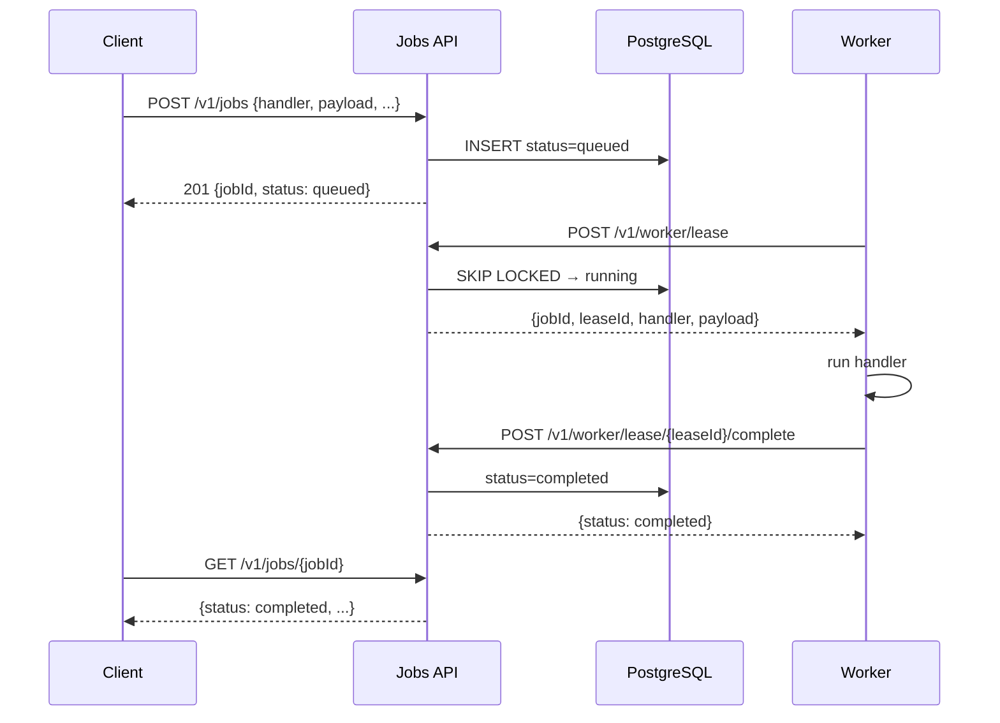
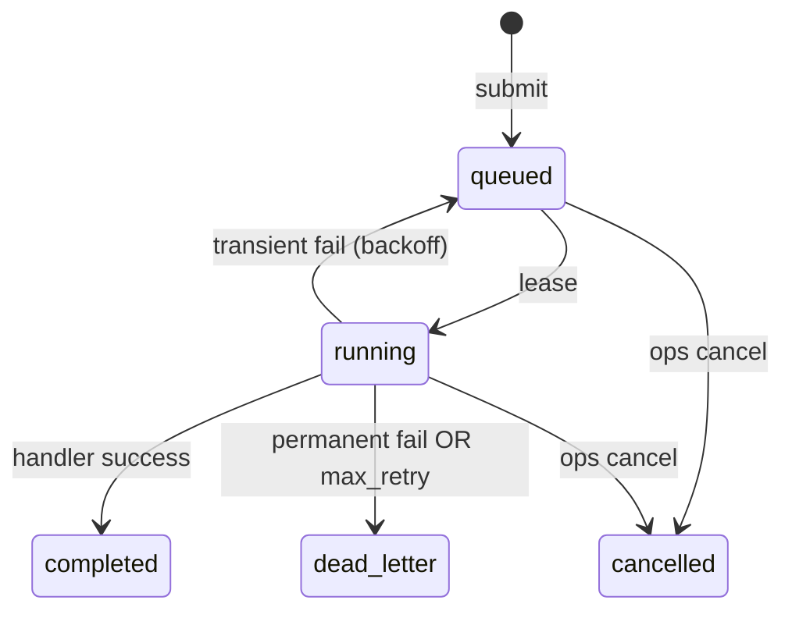

# User flows — Jobqueue

End-user, worker, and operator journeys with API calls and state transitions.

**Base URL:** `http://165.245.153.10` (or your LoadBalancer IP)

---

## 1. Client: submit and poll (happy path)



**Example:**

```bash
# Submit
curl -s -X POST $INGRESS/v1/jobs \
  -H 'Content-Type: application/json' \
  -d '{"queue":"default","handler":"echo","payload":{"orderId":"123"}}'

# Poll until completed
curl -s $INGRESS/v1/jobs/JOB_ID
```

**Idempotent submit:** Pass same `jobId` — returns existing job, no duplicate row.

```bash
curl -s -X POST $INGRESS/v1/jobs \
  -H 'Content-Type: application/json' \
  -d '{"jobId":"order-123","handler":"echo","payload":{}}'
# Resubmit with same jobId → same job
```

---

## 2. Client: list recent runs

No per-user auth in MVP — list is **per queue**.

```bash
curl -s "$INGRESS/v1/jobs?queue=default&limit=20"
```

Response: `{ "queue": "default", "jobs": [ ... ] }`

---

## 3. Failure, retry, and DLQ



**Transient failure** (handler returns `transient_failure`, timeout, lease expired):

- Job → `queued` with `nextRetryAt` (10s → 30s → 90s → 300s)
- `attempt` incremented on each lease

**Dead letter** when `attempt >= max_retry` or `permanent_failure`.

**Example — fast DLQ:**

```bash
curl -s -X POST $INGRESS/v1/jobs \
  -H 'Content-Type: application/json' \
  -d '{"handler":"fail-once","max_retry":1,"timeout_sec":60,"payload":{}}'
# → dead_letter after first fail
```

---

## 4. Timeout flow

Submit short `timeout_sec` with slow handler:

```bash
curl -s -X POST $INGRESS/v1/jobs \
  -H 'Content-Type: application/json' \
  -d '{"handler":"slow","payload":{"sleepMs":20000},"timeout_sec":3,"max_retry":1}'
```

1. Worker leases job
2. Worker starts handler; `AbortSignal` fires at 3s
3. Handler returns `transient_failure` (TIMEOUT)
4. With `max_retry=1` → `dead_letter`

**Two timeout mechanisms:**

| Layer | Behavior |
|-------|----------|
| Worker | `AbortSignal` at `timeout_sec` |
| DB lease | `lease_expires_at`; sweeper requeues if worker crashes without reporting |

---

## 5. Operator: cancel

### Cancel queued job

Job never picked up — immediate `cancelled`.

```bash
curl -s -X POST $INGRESS/v1/ops/jobs/JOB_ID/cancel
curl -s $INGRESS/v1/jobs/JOB_ID   # status: cancelled
```

### Cancel running job

Revokes lease in DB. Worker may still finish handler locally (best-effort).

```bash
# Submit long-running job
curl -s -X POST $INGRESS/v1/jobs \
  -H 'Content-Type: application/json' \
  -d '{"handler":"slow","payload":{"sleepMs":120000},"timeout_sec":300,"max_retry":1}'

# Wait until running, then:
curl -s -X POST $INGRESS/v1/ops/jobs/JOB_ID/cancel
```

If worker tries complete/fail after cancel → API returns `409 lease_expired`.

---

## 6. Operator: queue visibility

```bash
curl -s $INGRESS/v1/ops/queues/default/status
```

Returns:

- `depthByStatus` — counts per status (`queued`, `running`, `completed`, `dead_letter`, …)
- `depthByPriority` — queued depth by priority label

---

## 7. Worker flow (internal)

Workers **only** call Worker Lease API — never PostgreSQL.

```
loop forever:
  POST /v1/worker/lease {queue, workerId, waitTimeSec: 20}
  if 204 → continue
  run handler with AbortSignal(timeout_sec)
  if success → POST .../complete
  else       → POST .../fail {failureType, error}
```

Env: `API_URL`, `WORKER_QUEUES`, `WORKER_CONCURRENCY`, `WORKER_ID`.

---

## 8. At-least-once: what clients must assume

| Scenario | What happens |
|----------|--------------|
| Worker crashes after handler work, before complete | Another worker may run handler again |
| Duplicate complete with stale leaseId | Rejected (`409 lease_expired`) |
| Same jobId submitted twice | Same row (idempotent create) |

**Handler authors:** make side effects idempotent using `jobId` + `attempt` or external dedup store.

---

## 9. API reference (MVP)

| Method | Path | Role |
|--------|------|------|
| GET | `/health` | Liveness |
| GET | `/ready` | Postgres connectivity |
| POST | `/v1/jobs` | Submit job |
| GET | `/v1/jobs?queue=&limit=` | List recent jobs |
| GET | `/v1/jobs/{jobId}` | Job status |
| POST | `/v1/worker/lease` | Worker dequeue (long-poll) |
| POST | `/v1/worker/lease/{leaseId}/complete` | Worker success |
| POST | `/v1/worker/lease/{leaseId}/fail` | Worker failure |
| GET | `/v1/ops/queues/{queue}/status` | Queue depth |
| POST | `/v1/ops/jobs/{jobId}/cancel` | Cancel queued/running |

**Allowed handlers (env):** `echo`, `fail-once`, `slow`
